# Laboratorio de Datos Estructurados
## Tabla de Contenidos

1. [Introducción](#1-introducción)
2. [Marco teórico](#2-marco-teórico)
3. [Objetivos](#3-objetivos)
4. [Metodología](#4-metodología)
5. [Resultados](#5-resultados)
6. [Referencias bibliográficas](#6-referencias-bibliográficas)

## 1. Introducción
</div>

## 2. Marco teórico
</div>

## 3. Objetivos
1. **Procesamiento y análisis de señales biomédicas:**  Adquirir y organizar señales biomédicas de ECG en diferentes estados fisiológicos, aplicando técnicas adecuadas para su análisis.  

2. **Uso de herramientas de aprendizaje automático:**  Subir los datos a Edge Impulse para explorar su aplicación en el desarrollo de modelos de aprendizaje automático.

## 4. Metodología
1. **Preprocesamiento:**
   En los laboratorios previos, se obtuvo las siguientes señales de las siguientes caracteristicas:
      | Archivo                              | Tiempo           |
      |--------------------------------------|------------------|
      | Estado_Basal_Toma_1_I_deriv.txt      | 61.5 segundos    |
      | Estado_Basal_Toma_2_I_deriv.txt      | 62.85 segundos   |
      | Estado_Basal_Toma_3_I_deriv.txt      | 61.20 segundos   |
      | Estado_Basal_Toma_1_II_deriv.txt     | 60.60 segundos   |
      | Estado_Basal_Toma_1_III_deriv.txt    | 62.70 segundos   |
      | Estado_sin_Respiracion_I_deriv.txt   | 22.20 segundos   |
      | Estado_con_Respiracion_I_deriv.txt   | 30.90 segundos   |
      | Estado_sin_Respiracion_II_deriv.txt  | 21.15 segundos   |
      | Estado_con_Respiracion_II_deriv.txt  | 30.45 segundos   |
      | Estado_sin_Respiracion_III_deriv.txt | 21.15 segundos   |
      | Estado_con_Respiracion_III_deriv.txt | 30.75 segundos   |
      | Ejercicio_I_deriv.txt                | 31.05 segundos   |
      | Ejercicio_II_deriv.txt               | 30.75 segundos   |
      | Ejercicio_III_deriv.txt              | 31.20 segundos   |
      | Simulacion_60_bpm.txt                | 21.30 segundos   |
      | Simulacion_90_bpm.txt                | 20.55 segundos   |
      | Simulacion_120_bpm.txt               | 21.30 segundos   |
      | Simulacion_150_bpm.txt               | 21.30 segundos   |
   
   Se utilizo el siguiente codigo para guardar segmentos de 10 segundos de las señales de ECG adquiridas.
      ```
         import numpy as np
         import csv
         import os
         
         # Establece la frecuencia de muestreo (Hz)
         Fs = 1000  # Frecuencia de muestreo (Ejemplo: 1000 Hz)
         segment_duration = 10  # Duración de cada segmento en segundos
         samples_per_segment = Fs * segment_duration  # Número de muestras por segmento
         
         # Ruta de los archivos .txt
         file_paths = [
             "C:\\Users\\Ingrid\\Downloads\\Señales_2\\Estado_Basal_Toma_1_I_deriv.txt",
             "C:\\Users\\Ingrid\\Downloads\\Señales_2\\Estado_Basal_Toma_2_I_deriv.txt",
             "C:\\Users\\Ingrid\\Downloads\\Señales_2\\Estado_Basal_Toma_3_I_deriv.txt",
             "C:\\Users\\Ingrid\\Downloads\\Señales_2\\Estado_Basal_Toma_1_II_deriv.txt",
             "C:\\Users\\Ingrid\\Downloads\\Señales_2\\Estado_Basal_Toma_1_III_deriv.txt",
             "C:\\Users\\Ingrid\\Downloads\\Señales_2\\Estado_sin_Respiracion_I_deriv.txt",
             "C:\\Users\\Ingrid\\Downloads\\Señales_2\\Estado_con_Respiracion_I_deriv.txt",
             "C:\\Users\\Ingrid\\Downloads\\Señales_2\\Estado_sin_Respiracion_II_deriv.txt",
             "C:\\Users\\Ingrid\\Downloads\\Señales_2\\Estado_con_Respiracion_II_deriv.txt",
             "C:\\Users\\Ingrid\\Downloads\\Señales_2\\Estado_sin_Respiracion_III_deriv.txt",
             "C:\\Users\\Ingrid\\Downloads\\Señales_2\\Estado_con_Respiracion_III_deriv.txt",
             "C:\\Users\\Ingrid\\Downloads\\Señales_2\\Ejercicio_I_deriv.txt",
             "C:\\Users\\Ingrid\\Downloads\\Señales_2\\Ejercicio_II_deriv.txt",
             "C:\\Users\\Ingrid\\Downloads\\Señales_2\\Ejercicio_III_deriv.txt",
             "C:\\Users\\Ingrid\\Downloads\\Señales_2\\Simulacion_60_bpm.txt",
             "C:\\Users\\Ingrid\\Downloads\\Señales_2\\Simulacion_120_bpm.txt",
             "C:\\Users\\Ingrid\\Downloads\\Señales_2\\Simulacion_150_bpm.txt",
             "C:\\Users\\Ingrid\\Downloads\\Señales_2\\Simulacion_90_bpm.txt"
         ]
         
         # Carpeta de salida para los archivos CSV
         output_folder = "C:\\Users\\Ingrid\\Downloads\\"
         
         # Procesar cada archivo .txt
         for file_path in file_paths:
             # Leer el archivo .txt y encontrar la línea de 'EndOfHeader'
             with open(file_path, 'r') as file:
                 lines = file.readlines()
         
             # Buscar la línea que contiene 'EndOfHeader'
             data_start = None
             for i, line in enumerate(lines):
                 if 'EndOfHeader' in line:
                     data_start = i + 1
                     break
         
             if data_start is None:
                 raise ValueError(f"No se encontró 'EndOfHeader' en el archivo {file_path}.")
         
             # Extraer las líneas de datos (sin la parte del encabezado)
             data_lines = lines[data_start:]
         
             # Convertir las líneas de datos a un array de NumPy
             data = np.array([list(map(float, line.strip().split('\t'))) for line in data_lines])
         
             # Calcular la duración total de la señal en segundos
             num_rows = len(data)
             total_duration_seconds = num_rows / Fs
         
             # Imprimir información básica
             print(f"Procesando archivo: {file_path}")
             print(f"Frecuencia de muestreo: {Fs} Hz")
             print(f"Número total de filas: {num_rows}")
             print(f"Duración total de la señal en segundos: {total_duration_seconds} segundos")
         
             # Dividir los datos en segmentos de 5 segundos
             num_segments = num_rows // samples_per_segment
         
             # Generar archivos CSV para cada segmento
             for segment_idx in range(num_segments):
                 # Obtener las filas para el segmento actual
                 segment_data = data[segment_idx * samples_per_segment: (segment_idx + 1) * samples_per_segment]
         
                 # Generar el nombre del archivo CSV
                 file_name = os.path.basename(file_path).replace('.txt', f'_segment_{segment_idx + 1}.csv')
                 output_file_path = os.path.join(output_folder, file_name)
         
                 # Guardar el segmento de datos en un archivo CSV
                 with open(output_file_path, mode='w', newline='') as csv_file:
                     writer = csv.writer(csv_file)
                     writer.writerows(segment_data)
         
                 print(f"Guardado archivo CSV: {output_file_path}")
         
             print(f"Archivos CSV generados para: {file_path}\n")
      ```
   Se obtuvo la siguiente cantidad de segmentos:
      | Archivo                              | Nro. de segmentos|
      |--------------------------------------|------------------|
      | Estado_Basal_Toma_1_I_deriv.txt      | 6   |
      | Estado_Basal_Toma_2_I_deriv.txt      | 6   |
      | Estado_Basal_Toma_3_I_deriv.txt      | 6   |
      | Estado_Basal_Toma_1_II_deriv.txt     | 6   |
      | Estado_Basal_Toma_1_III_deriv.txt    | 6   |
      | Estado_sin_Respiracion_I_deriv.txt   | 2   |
      | Estado_con_Respiracion_I_deriv.txt   | 3   |
      | Estado_sin_Respiracion_II_deriv.txt  | 2   |
      | Estado_con_Respiracion_II_deriv.txt  | 3   |
      | Estado_sin_Respiracion_III_deriv.txt | 2   |
      | Estado_con_Respiracion_III_deriv.txt | 3   |
      | Ejercicio_I_deriv.txt                | 3   |
      | Ejercicio_II_deriv.txt               | 3   |
      | Ejercicio_III_deriv.txt              | 3   |
      | Simulacion_60_bpm.txt                | 2   |
      | Simulacion_90_bpm.txt                | 2   |
      | Simulacion_120_bpm.txt               | 2   |
      | Simulacion_150_bpm.txt               | 2   |
   
2. **CSV Wizard:**
   Para garantizar una correcta integración de los segmentos en el dataset, se utilizó la herramienta **CSV Wizard**, configurada para procesar los archivos de manera uniforme. A continuación, se detallan los pasos realizados:

      | **Pasos** | **Imágenes** |
      | --- | --- |
      | **Paso 1:** Cargar un archivo de datos al **CSV Wizard** para iniciar la configuración de los parámetros necesarios. Esto permite establecer las reglas de procesamiento desde el inicio. | 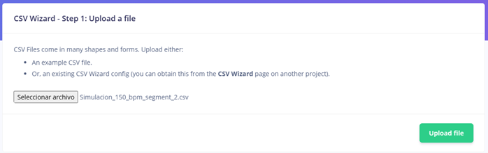 |
      | **Paso 2:** Configurar las delimitaciones del archivo: <ul><li>Separador: **Comas**</li><li>Omitir líneas: **Ninguna**</li><li>Encabezado: **"No header row"**</li></ul> Estas configuraciones aseguran que todos los datos sean interpretados correctamente. | 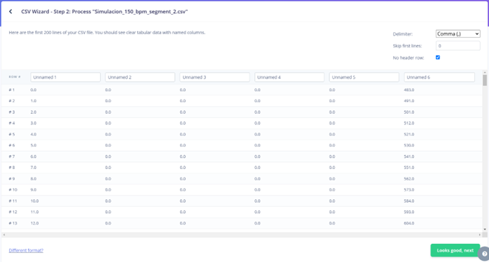 |
      | **Paso 3:** Establecer la frecuencia de muestreo a **1000 Hz**, reflejando el intervalo de tiempo con el que los datos fueron registrados. Este paso es crucial para mantener la integridad del análisis de las señales. | 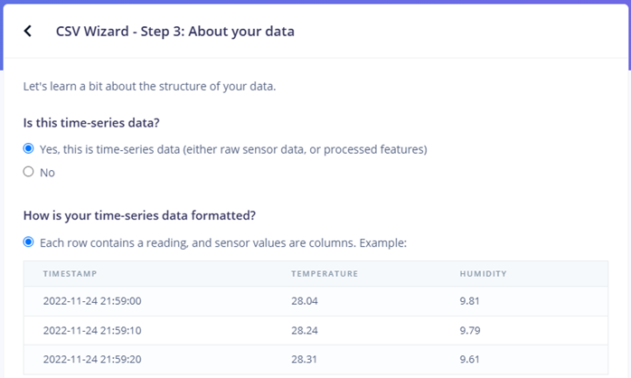 |
      |  |  |
      | **Paso 4:** Seleccionar la columna de datos correspondiente, especificando la señal o información relevante dentro del archivo CSV. | 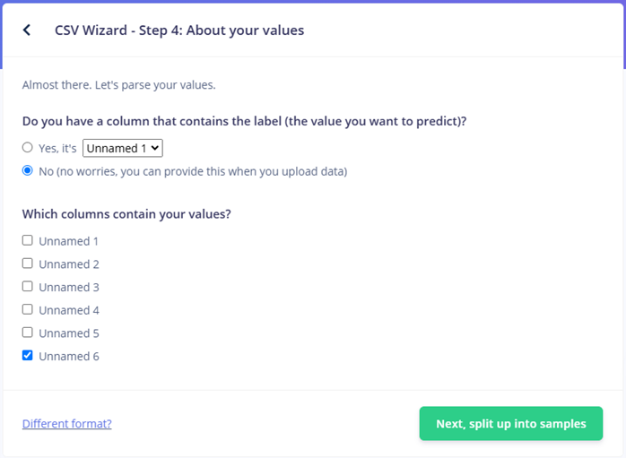 |
      |  | 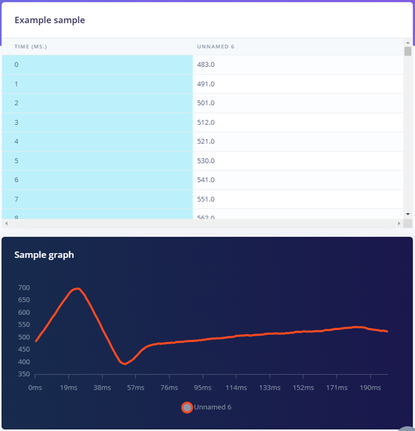 |
      | **Paso 5:** Indicar la duración de las muestras seleccionando **"Unlimited"** en la opción *How long do you want your samples to be*. Esto permite que las muestras se procesen completas sin restricciones de longitud. | 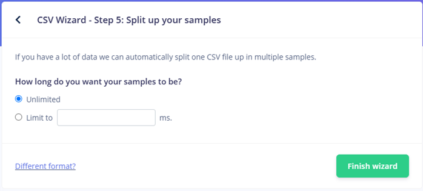 |
      | **Paso 6:** Confirmar la configuración. Una vez finalizado, se muestra un mensaje indicando que cualquier archivo CSV subido al proyecto será procesado según las reglas definidas en este asistente (*Any CSV files that you upload into your project will be processed according to the rules you set up here*). Este paso garantiza la uniformidad en el tratamiento de los datos. | 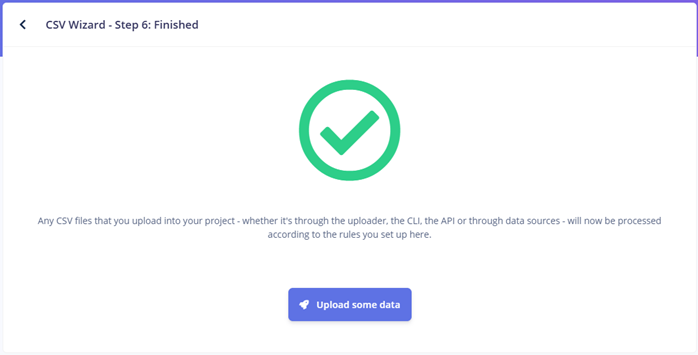 |

3. **Dataset:**
   Se subieron 6 segmentos de cada tipo de señal al dataset principal (Basal, Ejercicio, ProSim, etc). Los segmentos sobrantes se utilizaron para balancear las proporciones entre las partes de entrenamiento (*training*) y prueba (*testing*) de la base de datos.
      <div style="text-align: center;">
        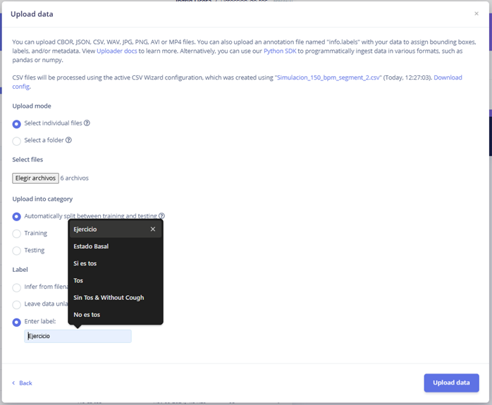
      </div>

## 5. Resultados
1. **Link:**
   https://studio.edgeimpulse.com/studio/55816
   
2. **Tabla de Señales**
      | **Training Dataset** | **Test Dataset** |
      | --- | --- |
      | 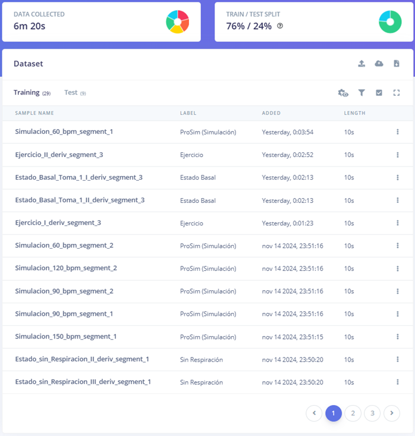 | 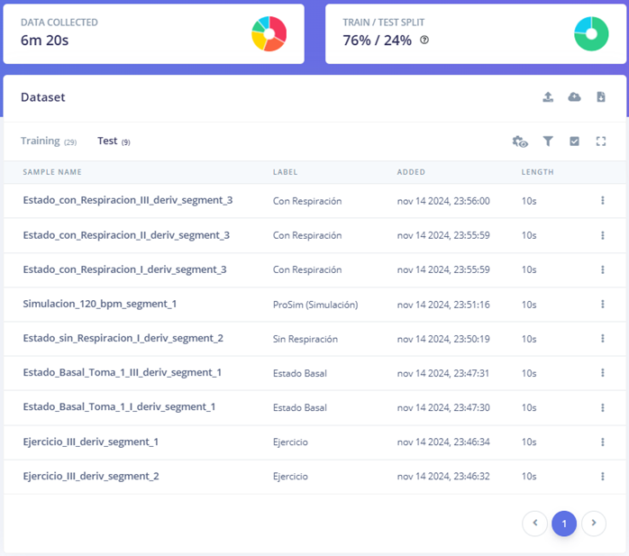 |

      | **Categoria de señal ECG** | **Señal** |
      | --- | --- |
      | Estado Basal |  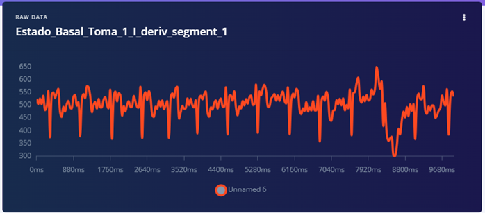 |
      | Estado con respiración | 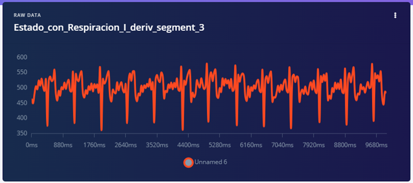 |
      | Estado sin respiración | 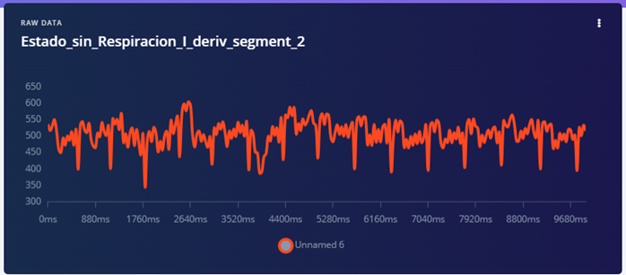 |
      | Ejercicio | 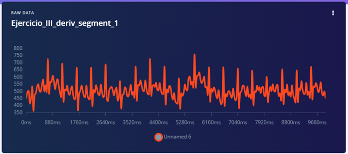 |
      | Simulación (ProSim) | 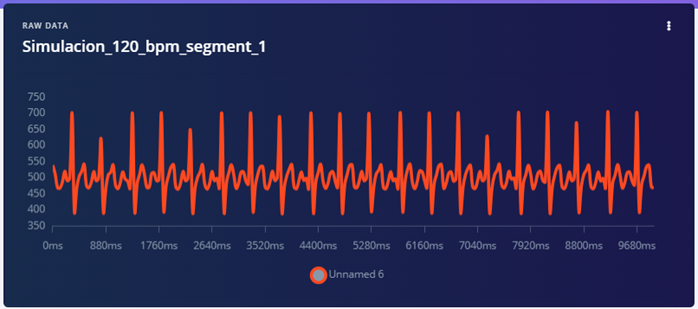 |

## 6. Referencias bibliográficas
