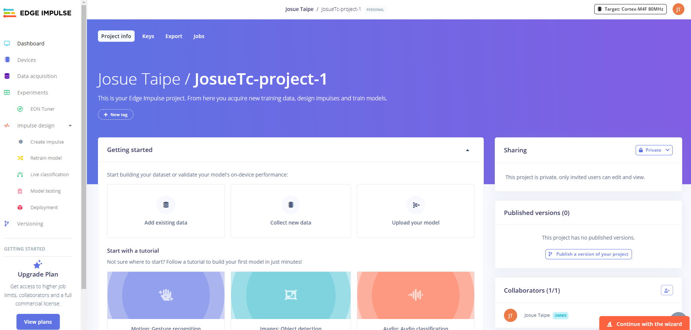

# Laboratorio de Edge Impulse 

## Tabla de Contenidos

1. [Introducción](#1-introducción)
2. [Objetivos](#2-objetivos)
3. [Metodología](#3-metodología)
4. [Resultados](#4-resultados)


## 1. Introducción

Edge Impulse es una plataforma diseñada para desarrollar algoritmos de aprendizaje automático (machine learning) específicamente optimizados para sistemas embebidos y dispositivos que operan en tiempo real. Su principal objetivo es simplificar las etapas de adquisición, procesamiento de datos y generación de modelos de machine learning.

Esta herramienta resulta especialmente útil en aplicaciones como el análisis y procesamiento de señales biomédicas, por ejemplo, el electrocardiograma (ECG), donde se requiere precisión y rapidez en el procesamiento de datos para tareas como el monitoreo continuo y el diagnóstico médico.

En este informe se detallará el proceso de adquisición de datos y su integración con Edge Impulse como punto de partida para la creación de un proyecto completo. La documentación incluirá cada uno de los pasos necesarios, desde la recolección inicial de las señales hasta la configuración y entrenamiento del modelo, buscando optimizar el rendimiento en un entorno embebido y demostrar la utilidad de esta plataforma en el análisis en tiempo real de datos biomédicos.
<div align="center">
  <p>

  **Figura 1. Página inicial Edge Impulse**
  </p>
</div>

## 2. Objetivos
1. Organizar y adquirir señales de ECG: Capturar señales de ECG en diferentes estados fisiológicos (reposo, actividad, estrés, etc.) asegurando que estén en un formato adecuado para su uso y análisis posterior.
2. Procesar y pre-etiquetar las señales: Realizar una limpieza inicial de los datos adquiridos (remoción de ruido, normalización, etc.) y etiquetarlas según los estados fisiológicos correspondientes
3. Subir y organizar los datos en Edge Impulse: Integrar las señales preprocesadas en la plataforma Edge Impulse, categorizándolas de manera clara y sistemática para facilitar el entrenamiento del modelo.
4. Diseñar y entrenar un modelo de aprendizaje automático: Utilizar los datos organizados para crear un modelo de machine learning que pueda clasificar o analizar señales de ECG en tiempo real.
5. Validar y evaluar el modelo: Implementar pruebas para medir la precisión, sensibilidad y especificidad del modelo desarrollado, asegurando que cumpla con los estándares requeridos para aplicaciones biomédicas.
6. Optimizar el modelo para dispositivos embebidos: Reducir la complejidad del modelo para garantizar su desempeño eficiente en sistemas embebidos.


## 3. Metodología

# Adquisición de datos y conversión de formato

En este repositorio de GitHub se documentó el proceso de adquisición de señales de ECG bajo diferentes condiciones fisiológicas, detalladas de la siguiente manera:

## Estados registrados

- **Estado basal**  
  Se registró la actividad del ECG mientras el estudiante se encontraba en reposo, en un estado de calma y relajación.

- **Estado de pausa respiratoria (durante y después)**  
  El estudiante realizó una pausa respiratoria de 10 segundos, registrándose el ECG durante este intervalo. Posteriormente, se realizó un segundo registro para analizar las variaciones en la señal tras la contención de la respiración.

- **Estado posterior a actividad física**  
  El ECG se obtuvo después de que el estudiante realizara ejercicios aeróbicos intensos durante aproximadamente 5 minutos, alcanzando un estado de fatiga.

- **Simulación con ProSim 4**  
  Se incluyeron señales generadas por el ProSim 4, un simulador portátil de signos vitales utilizado para pruebas rápidas con frecuencias cardíacas específicas: 60, 90, 120 y 150 bpm.

## Procesamiento de las señales

Las señales fueron adquiridas utilizando el software **OpenSignals**, que permitió exportarlas en formato **.txt**. 
Se utilizo el siguiente codigo para guardar segmentos de 10 segundos de las señales de ECG adquiridas.

## Código para procesar archivos .txt y generar archivos CSV

Este script procesa múltiples archivos de datos en formato `.txt` y genera archivos CSV para cada segmento de 10 segundos de duración.

```python
import numpy as np
import csv
import os
   
# Establece la frecuencia de muestreo (Hz)
Fs = 1000  # Frecuencia de muestreo (Ejemplo: 1000 Hz)
segment_duration = 10  # Duración de cada segmento en segundos
samples_per_segment = Fs * segment_duration  # Número de muestras por segmento
   
# Ruta de los archivos .txt
file_paths = [
    "D:\\UNIV\\Introducción Señales\\lab edgeimpulse\\codigos\\Ejercicio I deriv.txt",
    "D:\\UNIV\\Introducción Señales\\lab edgeimpulse\\codigos\\Ejercicio II deriv.txt",
    "D:\\UNIV\\Introducción Señales\\lab edgeimpulse\\codigos\\Ejercicio III deriv.txt",
    "D:\\UNIV\\Introducción Señales\\lab edgeimpulse\\codigos\\Estado basal I deriv.txt",
    "D:\\UNIV\\Introducción Señales\\lab edgeimpulse\\codigos\\Estado basal III deriv.txt",
    "D:\\UNIV\\Introducción Señales\\lab edgeimpulse\\codigos\\Estado basal Toma 1 I deriv.txt",
    "D:\\UNIV\\Introducción Señales\\lab edgeimpulse\\codigos\\Estado basal Toma 2 I deriv.txt",
    "D:\\UNIV\\Introducción Señales\\lab edgeimpulse\\codigos\\Estado basal Toma 3 I deriv.txt",
    "D:\\UNIV\\Introducción Señales\\lab edgeimpulse\\codigos\\Estado con Respiracion I deriv.txt",
    "D:\\UNIV\\Introducción Señales\\lab edgeimpulse\\codigos\\Estado con Respiracion II deriv.txt",
    "D:\\UNIV\\Introducción Señales\\lab edgeimpulse\\codigos\\Estado con Respiracion III deriv.txt",
    "D:\\UNIV\\Introducción Señales\\lab edgeimpulse\\codigos\\Estado sin Respiracion I deriv.txt",
    "D:\\UNIV\\Introducción Señales\\lab edgeimpulse\\codigos\\Estado sin Respiracion II deriv.txt",
    "D:\\UNIV\\Introducción Señales\\lab edgeimpulse\\codigos\\Estado sin Respiracion III deriv.txt",
    "D:\\UNIV\\Introducción Señales\\lab edgeimpulse\\codigos\\Simulacion 60 bpm.txt",
    "D:\\UNIV\\Introducción Señales\\lab edgeimpulse\\codigos\\Simulacion 90 bpm.txt",
    "D:\\UNIV\\Introducción Señales\\lab edgeimpulse\\codigos\\Simulacion 120 bpm.txt",
    "D:\\UNIV\\Introducción Señales\\lab edgeimpulse\\codigos\\Simulacion 150 bpm.txt"
]

# Carpeta de salida para los archivos CSV
output_folder = "D:\\UNIV\\Introducción Señales\\lab edgeimpulse"

# Procesar cada archivo .txt
for file_path in file_paths:
    # Leer el archivo .txt y encontrar la línea de 'EndOfHeader'
    with open(file_path, 'r') as file:
        lines = file.readlines()

    # Buscar la línea que contiene 'EndOfHeader'
    data_start = None
    for i, line in enumerate(lines):
        if 'EndOfHeader' in line:
            data_start = i + 1
            break

    if data_start is None:
        raise ValueError(f"No se encontró 'EndOfHeader' en el archivo {file_path}.")

    # Extraer las líneas de datos (sin la parte del encabezado)
    data_lines = lines[data_start:]

    # Convertir las líneas de datos a un array de NumPy
    data = np.array([list(map(float, line.strip().split('\t'))) for line in data_lines])

    # Calcular la duración total de la señal en segundos
    num_rows = len(data)
    total_duration_seconds = num_rows / Fs

    # Imprimir información básica
    print(f"Procesando archivo: {file_path}")
    print(f"Frecuencia de muestreo: {Fs} Hz")
    print(f"Número total 
```


## 4. Resultados
