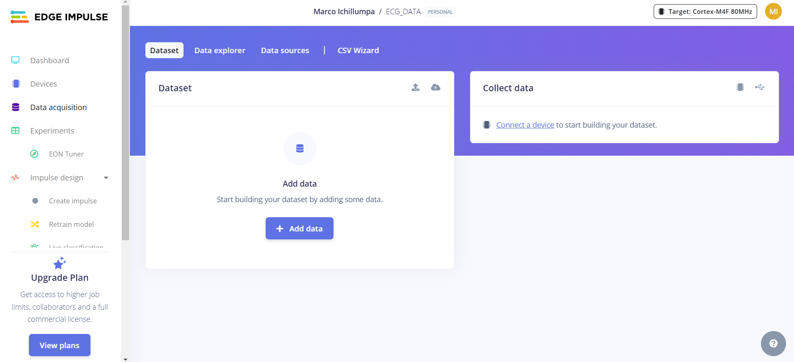
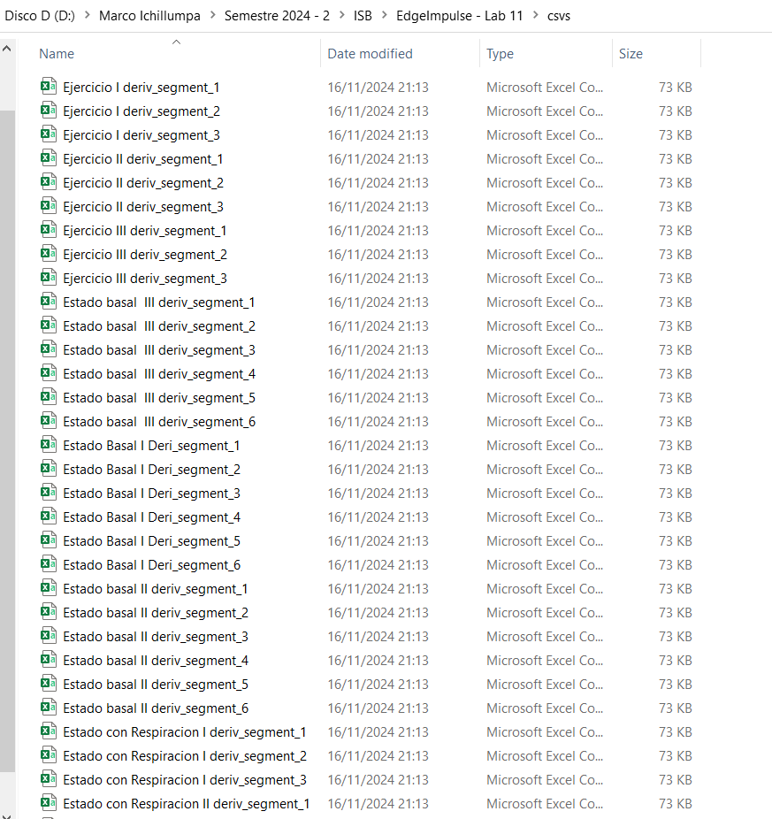

# Laboratorio de Edge Impulse 

## Tabla de Contenidos

1. [Introducción](#1-introducción)
2. [Objetivos](#2-objetivos)
3. [Metodología](#3-metodología)
4. [Resultados](#5-resultados)


## 1. Introducción

Edge Impulse es una plataforma para desarrollar algoritmos de aprendizaje automático (machine learning) diseñados para sistemas embebidos, dispositivos que realizan tareas en tiempo real,con la finalidad de simplificar el proceso de adquisición y procesamiento de datos. El propósito de esta plataforma es facilitar el desarrollo de modelos de machine learning.

Por ello, para una tarea como lo es el análisis y procesamiento de señales biomédicas en tiempo real como el ECG, el uso de Edge Impulse es importante en aplicaciones como el diagnóstico y monitoreo.

En el presente informe se mostrará la adquisición de datos para la plataforma Edge Impulse como inicio de la creación de un proyecto de esta herramienta.

<div align="center">
  <p>

  **Figura 1. Página inicial del presento proyecto en EdgeImpulse**
  </p>
</div>


## 2. Objetivos
1. Organizar y adquirir señales de ECG en diferentes estados con un formato adecuado para su futuro uso y análisis.

2. Subir y organizar en el Edge Impulse las señales adquiridas, categorizándolas por sus estados.
 
 
## 3. Metodología
1. **Adquisición de data y conversión del formato:**
   En este mismo GitHub se documentó la adquisición previa de señales de ECG en distintos estados:

    - **Estado Basal:**
    Estado de reposo evaluado donde el estudiante se mantiene calmado y relajado.


    - **Estado de pausa respiratoria (durante y después):**
    El estudiante mantiene la respiración durante 10 segundos, mientras se registra su ECG en ese intervalo. Al concluir, se realiza un nuevo registro del ECG para observar las variaciones posteriores al ejercicio de contención de la respiración. 

    - **Estado después de una actividad física:**
    Durante 5 minutos aproximadamente, el estudiante realiza ejercicios aeróbicos intensos hasta llegar al cansancio. 

    - **Simulación - ProSim4:**
    Se obtuvo señales patrón gracias al ProSim 4, un simulador de signos vitales portátil diseñado para realizar pruebas rápidas en distintos bpm: 60, 120, 150 y 90.

    Las señales fueron adquiridas mediante el software OpenSignals y este las exportaba en un formato txt. Para su conversión se usó el siguiente código donde se especifica que cada señal sea dividida en segmentos de 10 segundos, con la finalidad de una estandarización al subirlo al Edge Impulse.

      ```
      import os
      import pandas as pd
      
      #Rutas de entrada y salida
      input_folder = 'D:\\Marco Ichillumpa\\Semestre 2024 - 2\\ISB\\EdgeImpulse - Lab 11\\data'
      output_folder = 'D:\\Marco Ichillumpa\\Semestre 2024 - 2\\ISB\\EdgeImpulse - Lab 11\\csvs'

      #Configuración
      fs = 1000  #Frecuencia de muestreo (Hz)
      segmento = 10  #Duración de cada segmento en segundos
      samples_per_segment = fs * segmento  #Muestras por segmento

      #Recorrer todos los archivos en la carpeta de entrada
      for file_name in os.listdir(input_folder):
        if file_name.endswith('.txt'):  #Filtrar solo los archivos .txt
            input_file = os.path.join(input_folder, file_name)
            
            #Leer el archivo, omitiendo las líneas de encabezado con #
            data = pd.read_csv(input_file, delimiter='\t', comment='#', header=None)
            
            #Solo importa la data de la columna 0 y 5
            selected_columns = data[[0, 5]]
            
            #Renombro la data
            selected_columns.columns = ['timestamp', 'data']
            
            #División de los segmentos
            num_segments = len(selected_columns) // samples_per_segment
            for segment_idx in range(num_segments):
                start_idx = segment_idx * samples_per_segment
                end_idx = start_idx + samples_per_segment
                segment = selected_columns.iloc[start_idx:end_idx]
                
                #Creación del archivo para cada segmento
                segment_file_name = f"{file_name.replace('.txt', '')}_segment_{segment_idx + 1}.csv"
                segment_output_path = os.path.join(output_folder, segment_file_name)
                
                #Guardado de los segmentos
                segment.to_csv(segment_output_path, index=False)
                
                print(f"Segmento creado: {segment_file_name}")
        print("Proceso completado.")
   ```
    El resultado fue el siguiente, donde las señales con mayor cantidad de segmentos fue las del estado basal con hasta 6. Los demás estados obtuvieron 3 segmentos a excepción del estado sin respiración que obtuvo 2 segmentos junto con las simulaciones.
<div align="center">
  <p>

  **Figura 2: Archivos segmentados creados con el código**
  </p>
</div>
   
3. **CSV Wizard:**
   

 
## 5. Resultados
1. **Link:**
   


