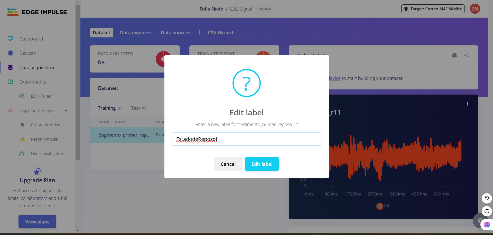

# Informe del Laboratorio de Edge Impulse
## Tabla de Contenidos

1. [Introducción](#1-introducción)
2. [Objetivos](#2-objetivos)
3. [Metodología](#3-metodología)
4. [Resultados](#4-resultados)

# 1. Introducción
Edge Impulse es una plataforma web diseñada específicamente para desarrollar modelos de aprendizaje automático (ML) que se ejecutan en dispositivos como microcontroladores, sensores, wearables y otro hardware con capacidad de procesamiento y memoria limitadas, simplificando la adquisición de datos al permitir a los desarrolladores recopilarlos y organizarlos directamente desde los dispositivos mencionados. Asimismo, esta plataforma contiene herramientas de procesamiento de señales y funciones que permiten extraer información significativa de los datos brutos de los sensores, con el fin de detectar patrones de movimiento a partir de las lecturas adquiridas. De esta manera, los modelos de aprendizaje automático pueden entrenarse directamente en Edge Impulse utilizando marcos populares como TensorFlow y ONNX, facilitando su uso en varios dispositivos, como Arduino, Raspberry Pi y placas STMicroelectronics.

La plataforma es especialmente valiosa por su capacidad de realizar procesamiento en tiempo real directamente en los dispositivos periféricos, eliminando la necesidad de servicios en la nube, reduciendo la latencia y ahorrando el ancho de banda, que permite una mayor privacidad de los datos. Por último, esta plataforma se utiliza ampliamente en sectores como la sanidad, donde impulsa wearables para la monitorización de la salud, y en el IoT industrial para tareas como el mantenimiento predictivo y el control de calidad
<div align="center">
  <p>
  </p>
</div>

# 2. Objetivos

## 2.1. Objetivo General
- Clasificar señales EEG mediante un modelo de aprendizaje automático desarrollado en Edge Impulse.

## 2.2. Objetivos Específicos
- Adquirir y organizar señales EEG según los diferentes ejercicios en un formato compatible para subirlos a Edge Impulse
- Segmentar y etiquetar las señales EEG según eventos específicos o estados, asegurando compatibilidad con Edge Impulse.
- Subir las señales preprocesadas a Edge Impulse y organizarlas en categorías claras para entrenamiento.
- Diseñar y entrenar un modelo de aprendizaje automático en Edge Impulse utilizando técnicas optimizadas para la clasificación de EEG.

# 3. Metodología
## 3.1. Descripción y Adquisición de los Datos

Para este laboratorio se usaron las señales EEG adquiridas durante el laboratorio N° usando el kit BITalino (r) evolution y el programa OpenSignal para la visualización y adquisición de la señal. 

Las señales de EEG fueron adquiridas durante tres actividades:

- Primer estado de Reposo: Se realizó un registro inicial de la señal de EEG en condiciones de reposo absoluto. Durante este periodo, el participante permaneció en silencio, respirando de manera normal, con los ojos cerrados y evitando movimientos musculares oculares. Este paso fue fundamental para obtener una referencia base con bajo nivel de ruido, que sirviera como control para las actividades posteriores.

- Ejercicio de ciclo de ojos cerrados y ojos abiertos: Se llevaron a cabo cinco ciclos alternados de abrir y cerrar los ojos, cada fase manteniéndose durante cinco segundos. Este ejercicio permitió capturar variaciones en la actividad cerebral asociadas con estados de vigilia visual y relajación ocular. Los datos obtenidos reflejan la transición entre ritmos alfa (ojos cerrados) y ritmos beta (ojos abiertos), ayudando a evaluar la respuesta cortical a estímulos visuales.

- Segunto estado de Reposo: Se repitió el registro de señal en reposo bajo las mismas condiciones del paso 1, asegurando la comparabilidad de los datos en diferentes momentos del experimento. Este segundo registro permitió verificar la estabilidad de la línea base y evaluar posibles cambios en la señal tras los ciclos previos.

- Ejercicio de Razonamiento Matemático: Durante esta fase, un compañero del equipo leyó en voz alta una serie de ejercicios matemáticos diseñados para estimular el procesamiento cognitivo. El participante debía resolver mentalmente cada problema mientras mantenía la mirada fija en un punto específico, reduciendo al mínimo los movimientos oculares y posibles artefactos. Este paso tuvo como objetivo evaluar la actividad cerebral durante un estado de concentración cognitiva intensa y compararla con las señales registradas en reposo.

Las señales presentaron una frecuencia de muestreo de 1000 Hz, con intervalos de tiempo que variaron entre 30 y 90 segundos, las cuales se exportaron como archivos txt.
<div align="center">
  <p>
  </p>
</div>

## 3.2.Procesamiento de los datos recopilados de la EEG

Las señales de EEG de cada actividad fueron procesadas y segmentadas utilizando un script en Python en fragmentos de 6 segundos, ya que esta es una duración estándar que permite capturar eventos fisiológicos importantes en la señal EEG mientras mantiene el tamaño de los archivos manejable, asegurando que todos los fragmentos tengan la misma longitud, lo cual es clave para entrenar modelos con entradas homogéneas. 
   ```
import csv

# Especifica las rutas de entrada y salida
archivo_txt = "C:\\Users\\sofmi\\OneDrive\\Desktop\\10MO CICLO\\INTRO SEÑALES\\SEÑALES A FILTRAR\\DATA EEG\\EstadodeReposoI.txt"  # Cambia esto por la ruta de tu archivo .txt
ruta_salida = "C:\\Users\\sofmi\\OneDrive\\Desktop\\10MO CICLO\\INTRO SEÑALES\\SEÑALES A FILTRAR\\DATA EEG\\Segmento_r1"  # Ruta de salida base para los archivos .csv

# Configuración de segmentación
DURACION_SEGMENTO = 6  # duración de cada segmento en segundos
FRECUENCIA_MUESTREO = 1000  # frecuencia de muestreo en Hz (ajusta según tu señal)

# Calcula el número de muestras por segmento
muestras_por_segmento = DURACION_SEGMENTO * FRECUENCIA_MUESTREO

# Abre el archivo de texto y lee todas las líneas
with open(archivo_txt, 'r') as txt_file:
    lineas = txt_file.readlines()

# Divide la señal en segmentos de 15 segundos y guarda cada segmento en un archivo .csv
for i in range(0, len(lineas), muestras_por_segmento):
    segmento = lineas[i:i + muestras_por_segmento]  # Extrae un segmento de 15 segundos

    # Genera el nombre del archivo de salida para el segmento actual
    archivo_csv = f"{ruta_salida}{i//muestras_por_segmento + 1}.csv"
    
    # Guarda el segmento en un archivo .csv
    with open(archivo_csv, 'w', newline='') as csv_file:
        escritor_csv = csv.writer(csv_file)
        
        # Procesa cada línea del segmento y escribe en el CSV
        for linea in segmento:
            columnas = linea.strip().split('	')  # Ajusta el delimitador si es necesario
            escritor_csv.writerow(columnas)

    print(f"Segmento guardado en '{archivo_csv}'")
      ```


Posteriormente se realizaron los siguientes pasos:
- Lee el archivo original que contiene la señal completa.
- Divide la señal en segmentos de 6 segundos, teniendo en cuenta una frecuencia de muestreo de 1000 Hz
- Elimina el encabezado de los datos recopilados, ya que Edge Impulse requiere que los datos subidos no incluyan encabezados o metadatos adicionales en los archivos CSV, ya que estos pueden interferir con el procesamiento automatizado de la plataforma.
<div align="center">
  <p>
  </p>
</div>

<div align="center">
  <p>
  </p>
</div>

- Exporta cada segmento como un archivo CSV independiente, listo para subir a Edge Impulse, ya que este es el formato en el cual trabaja la plataforma, al igual con los archivos de tipo json.

<div align="center">
  <p>
  </p>
</div>


De esta manera se obtuvieron la siguiente cantidad de segmentos para cada señal teniendo en cuenta el tiempo de duración de cada una:

[Aquí ingreso tabla]

## 3.3. Proceso de Subida de Datos a Edge Impulse

Para subir las señales EEG a Edge Impulse, primero creamos un proyecto llamado EEG-Signal, donde se subiran todos los archivos csv que contienen los segmentos de las señales para cada actividad de las señales EEG.

<div align="center">
  <p>
  <p>
  </p>
</div>


Una vez creado el proyecto, se accedió a la pestaña "Data Acquisition" para poder subir nuestros datos.
<div align="center">
  <p>
  </p>
</div>

Antes de subir los datos, se seleccionó la opción "CSV wizard". Este paso es fundamental para asegurar que los archivos CSV sean compatibles con los requerimientos de la plataforma y estén correctamente formateados.

<div align="center">
  <p>
  </p>
</div>

Se seleccionaron los archivos CSV generados previamente, cada archivo representando un segmento de 6 segundos de señal EEG, verificando que se subio correctamente.

<div align="center">
  <p>
  </p>
</div>

Ahora se configura las delimitaciones del archivo, para poder identificar y separar los datos, según su número de secuencia y su valor de amplitud. Como los datos se estan separando por comas, esta se selecciona como separador, además se destaca que al colocar el nuevo encabezado la plataforma logra identificar de mejor manera la columna de cada tipo de dato según su nombre, para garantizar una interpretación uniforme de los datos.

<div align="center">
  <p>
  </p>
</div>

Una vez configurado la delimitación y los encabezados, continuamos seleccionando "Yes, this is time-series data", debido a que los datos son secuenciales y se registraron a lo largo del tiempo. También se selecciona "Each row contains a reading, and sensor values are columns", ya que esta opción es común cuando cada fila del archivo representa una lectura única, y las columnas contienen varios datos. Esto permite trabajar con datos multivariables registrados simultáneamente. Esto es esencial para proyectos que requieren análisis de patrones en el tiempo, como clasificación de movimientos o procesamiento de señales.

<div align="center">
  <p>
  </p>
</div>


Asimismo, se establece la frecuencia de muestreo en 1000 Hz, correspondiente al intervalo con el que se registraron los datos, asegurando la integridad del análisis.
<div align="center">
  <p>
  </p>
</div>

Posteriormente, se selecciona la columna del archivo que contiene los datos relevantes, como las señales o información específica a procesar.
<div align="center">
  <p>
  </p>
</div>

Como la duración de las muestras fue definida en el código, ya que la señal fue previemente procesada en segmentos de 6 segundos,  se selecciona la opción "Unlimited" en el campo "How long do you want your samples to be", permitiendo que las muestras se procesen sin restricciones de longitud.
<div align="center">
  <p>
  </p>
</div>


Confirma la configuración final. Aparecerá un mensaje indicando que cualquier archivo CSV cargado en el proyecto será procesado según las reglas definidas, asegurando la uniformidad en el tratamiento de los datos.
<div align="center">
  <p>
  </p>
</div>


Ahora vamos a la opción "Upload Data" y subimos el archivo CSV procesado, colocandole un nombre definido en "Label", ya que si los datos contienen varias clases,  incluir etiquetas diferenciadas para cada categoría dentro del archivo CSV, o asignarlas después de subir los datos. De esta manera los datos estarán correctamente organizados y listos para el entrenamiento del modelo, donde se puede evaluar su balance.

<div align="center">
  <p>
  <p>
  </p>
</div>

De esta manera, subimos los segmentos de nuestras señales, los cuales se pueden visualizar en el cuadro derecho. Asimismo, si se requiere renombrar el archivo o cambiar la etiqueta, al seleccionar los tres puntos donde se encuentra el archivo se podrá ver las opciones para realizar los cambios.
<div align="center">
  <p>
  <p>
  <p>
  <p>
  </p>
</div>

Finalmente se obtuvieron, los siguientes resultados del balanceo:
Link de proyecto: https://studio.edgeimpulse.com/public/558174/live

<div align="center">
  <p>
  <p>
  <p>
  </p>
</div>


