# Laboratorio 12 - Edge impulse
## Tabla de Contenidos

1. [Introducción](#1-introducción)
2. [Marco teórico](#2-marco-teórico)
3. [Objetivos](#3-objetivos)
4. [Resultados](#4-resultados)

## 1. Introducción

El análisis de señales biomédicas, como las obtenidas mediante electrocardiografía (ECG), es fundamental en el ámbito de la salud para la detección temprana de enfermedades cardiovasculares y el monitoreo de estados fisiológicos. Este proyecto tiene como objetivo principal explorar el procesamiento y análisis de señales de ECG utilizando herramientas modernas de aprendizaje automático, como **Edge Impulse**. 

## 2. Marco teórico

### Señales de ECG
El electrocardiograma (ECG) es una representación gráfica de la actividad eléctrica del corazón, la cual es generada por la despolarización y repolarización de las células cardíacas. La señal de ECG contiene información crucial para identificar anomalías cardíacas, como arritmias o problemas de conducción eléctrica.

### Edge Impulse
Edge Impulse es una plataforma que permite desarrollar y entrenar modelos de aprendizaje automático optimizados para dispositivos embebidos. Ofrece herramientas para la adquisición, preprocesamiento y análisis de datos, permitiendo crear modelos personalizados para aplicaciones específicas. Su integración con dispositivos como microcontroladores y sensores lo convierte en una solución innovadora para aplicaciones en tiempo real, como la monitorización médica. En este proyecto, Edge Impulse se utilizó para cargar, procesar y entrenar un modelo basado en señales de ECG.

## 3. Objetivos
1. **Procesamiento y análisis de señales biomédicas:**  Adquirir y organizar señales biomédicas de ECG en diferentes estados fisiológicos, aplicando técnicas adecuadas para su análisis.  

2. **Uso de herramientas de aprendizaje automático:**  Subir los datos a Edge Impulse para explorar su aplicación en el desarrollo de modelos de aprendizaje automático.

## 4. Resultados
### 1. Create Impulse
  | **Estructura** | **Imágenes** |
  | --- | --- |
  |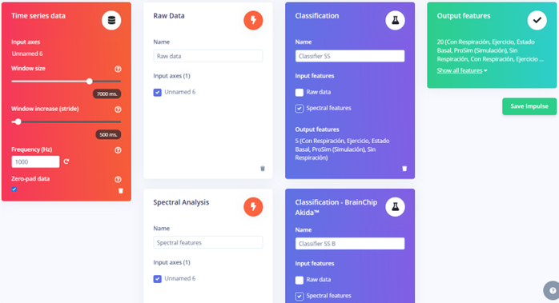|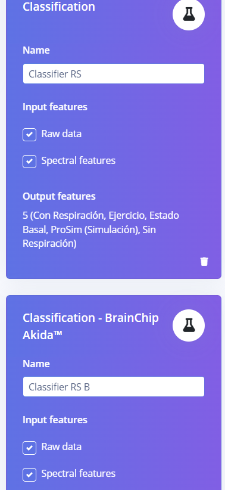|
### 2. Processing Blocks
#### 1. Raw Data
  | **Parameters** | **Generate Features** |
  | --- | --- |
  |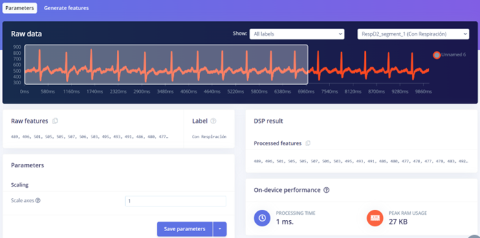|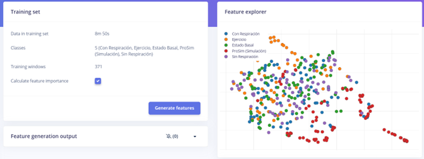|
#### 2. Spectral Analysis
  | **Parameters** |  |**Generate Features** |
  | --- | --- | --- |
  |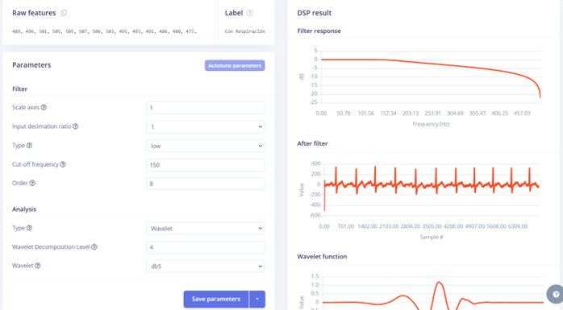|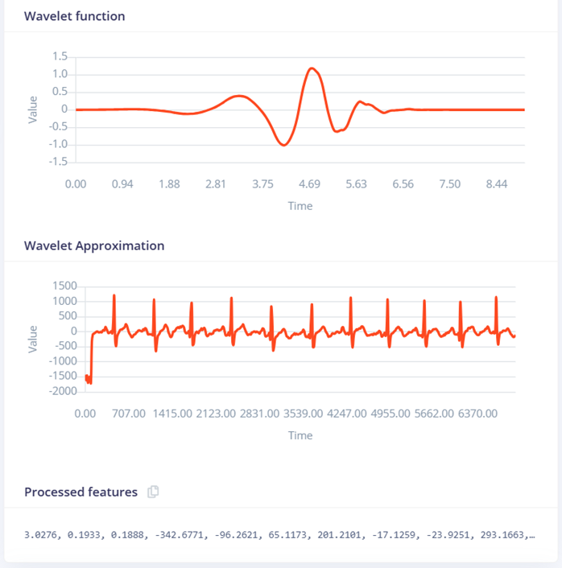|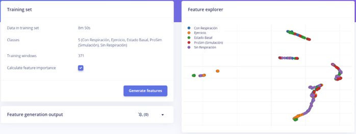|
### 3. Learning Blocks
#### 1. Classification (Solo Spectral Features)
  | **Resultados** | **Imágenes** |
  | --- | --- |
  |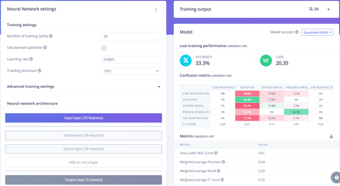|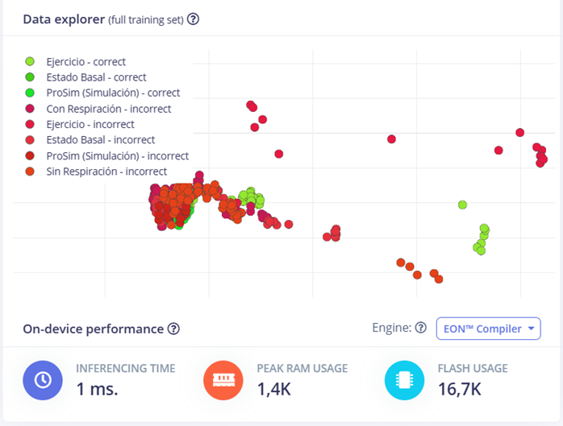|
#### 2. Classification - BrainChip Akida™ (Solo Spectral Features)
  | **Resultados** | **Imágenes** |
  | --- | --- |
  |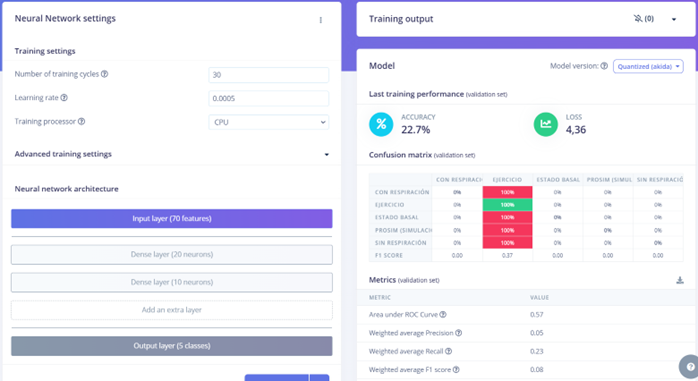|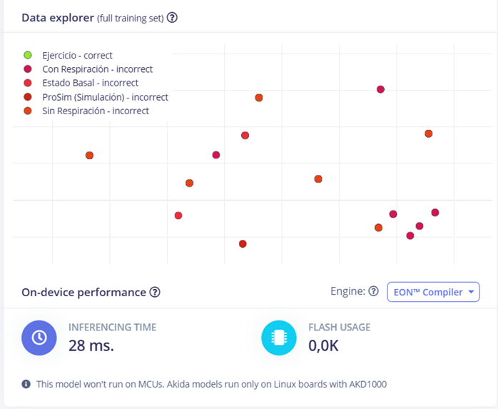|
#### 3. Classification (Raw Data y Spectral Features)
  | **Resultados** | **Imágenes** |
  | --- | --- |
  |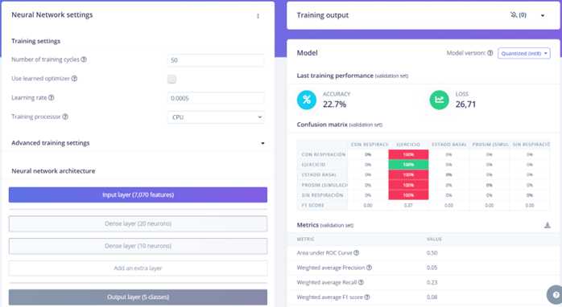|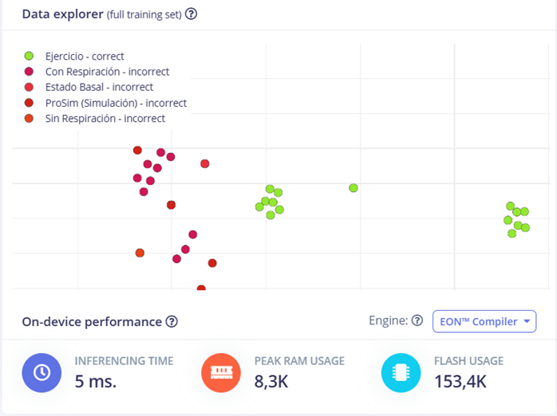|
#### 4. Classification - BrainChip Akida™ (Raw Data y Spectral Features)
  | **Resultados** | **Imágenes** |
  | --- | --- |
  |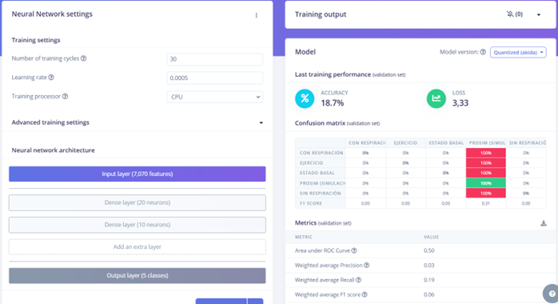|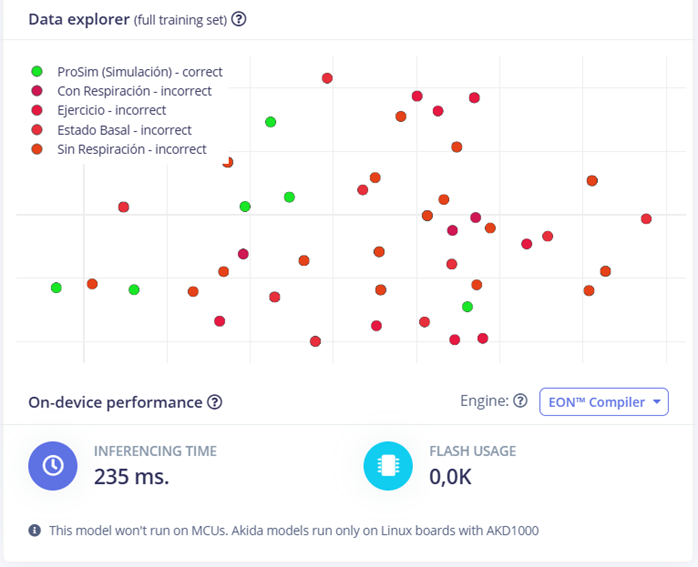|

