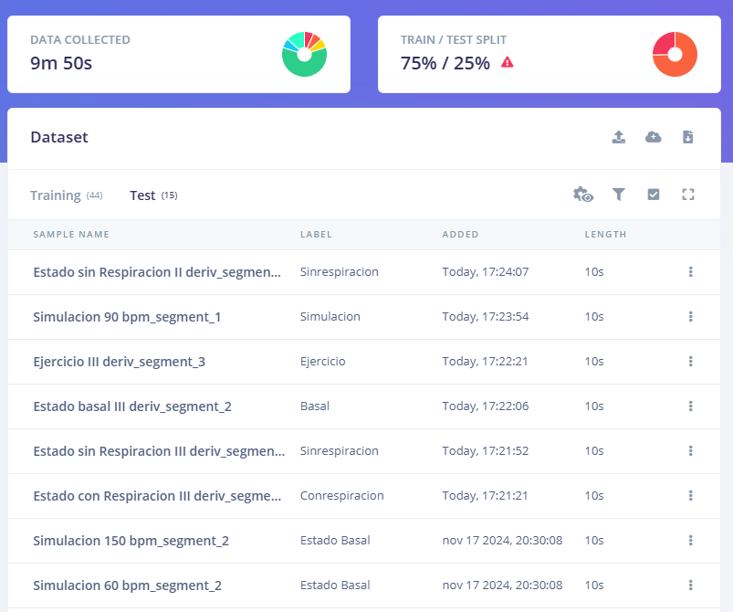
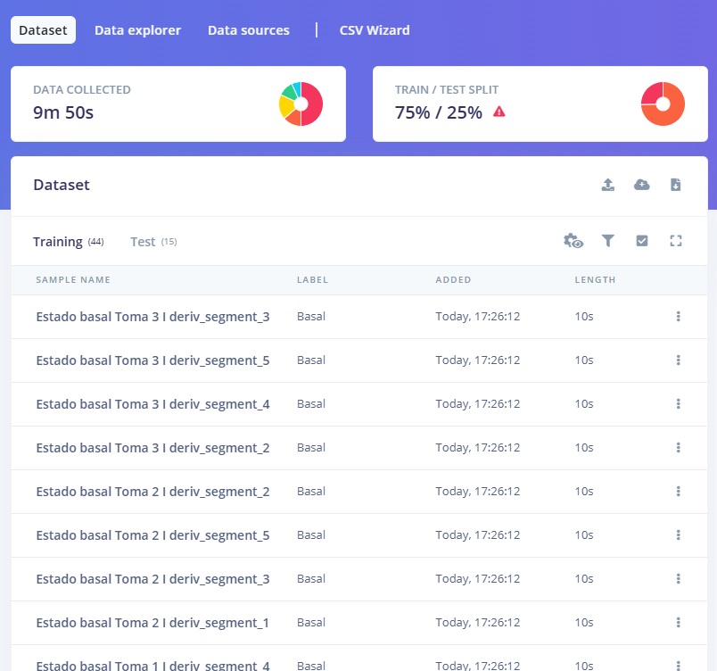

# LABORATORIO 13: Generacion Impulso Edge Impulse

## Contenido de la sesión

1. [Informe Laboratorio](#id1)
    - [Corrección Dataset](#id2)
    - [Create Impulse](#id3)
    - [Spectral features](#id4)
    - [Classifier](#id5)
    - [Retrain](#id6)
    - [Model Testing](#id7)

## 1. Informe Laboratorio 

### 1.1 Corrección Dataset 
[https://studio.edgeimpulse.com/studio/560365/acquisition/training?page=1 ](https://studio.edgeimpulse.com/public/560482/live)

#### Imagen 1: Arreglo de Data

  

  

  

### 1.2 Create Impulse 
Creamos el diseño y lo configuramos:

  

  

#### Imagen 3: Diseño del Impulso
Configuramos el window size de 1,9seg y un window increase de 1seg, la frecuencia de sampleo es de 1000 Hz, usamos Análisis Espectral y el clasificador.

  

  

