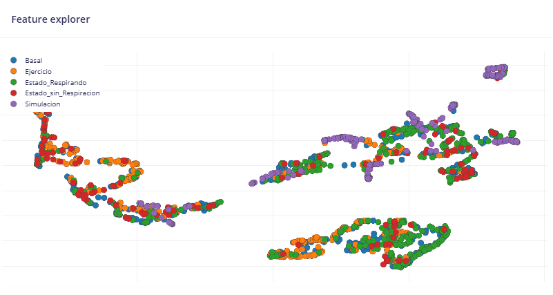
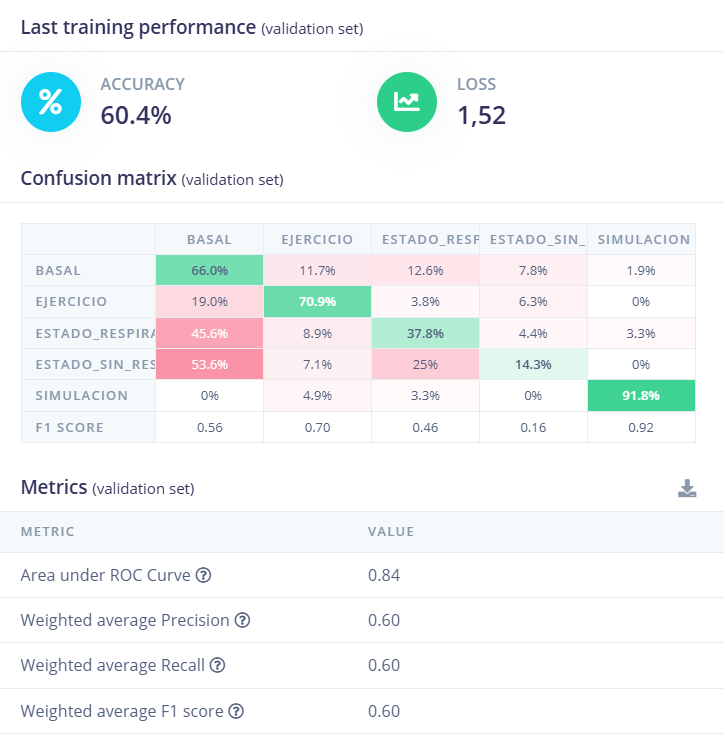

# Laboratorio de Edge Impulse 2

## Tabla de Contenidos

1. [Introducción](#1-introducción)
2. [Objetivos](#2-objetivos)
3. [Metodología](#3-metodología)
4. [Resultados](#4-resultados)
5. [Bibliografía](#5-bibliografía)


## 1. Introducción

En el anterior laboratorio se mencionó que Edge Impulse es una plataforma para desarrollar algoritmos de aprendizaje automático y que el propósito de usar esta herramienta era crear un proyecto para el reconocimiento de señales ECG, buscando clasificarlas en cinco diferentes estados de ECG: basal, sin respiración, después de aguantar la respiración, después de un ejercicio intenso y data dada gracias a la simulación.

En el presente informe se mostrará el uso de diseño del algoritmo para la clasificación de data ECG, explicando cada paso y parámetro que necesita Edge Impulse para lograr esto.

<div align="center">
  <p>

  **Figura 1. Página inicial del presente proyecto en Edge Impulse**
  </p>
</div>


## 2. Objetivos
1. Desarrollar un proyecto que pueda clasificar data de ECG en diferentes estados.

2. Buscar experimentar con los diferentes parámetros buscando la mayor precisión.
 
 
## 3. Metodología
1. **Adquisición de mayor cantidad de data:**
   En el anterior laboratorio se usó la data recogida por el presente equipo en los anteriores laboratorios dando como data total una duración de 6 minutos aproximadamente. En esta ocasión se usará la data recopilada de otros grupos con el fin de conseguir mayor información y mejorar la precisión de la clasificación.
   
   Para la segmentación de datos se usó nuevamente el anterior código con el adicional de las señales de los siguientes grupos: **G1, G5 y G6**. Nuevamente se buscó usar segmentos de 10 segundos para la estandarización del Edge Impulse.
<div align="center">
  <p>

  **Figura 2: Datos adicionales de los demás grupos**
  </p>
</div>

<br/><br/>


      ```
      import os
      import pandas as pd
      
      #Rutas de entrada y salida
      input_folder = 'D:\\Marco Ichillumpa\\Semestre 2024 - 2\\ISB\\EdgeImpulse - Lab 11\\data'
      output_folder = 'D:\\Marco Ichillumpa\\Semestre 2024 - 2\\ISB\\EdgeImpulse - Lab 11\\csvs'

      #Configuración
      fs = 1000  #Frecuencia de muestreo (Hz)
      segmento = 10  #Duración de cada segmento en segundos
      samples_per_segment = fs * segmento  #Muestras por segmento

      #Recorrer todos los archivos en la carpeta de entrada
      for file_name in os.listdir(input_folder):
        if file_name.endswith('.txt'):  #Filtrar solo los archivos .txt
            input_file = os.path.join(input_folder, file_name)
            
            #Leer el archivo, omitiendo las líneas de encabezado con #
            data = pd.read_csv(input_file, delimiter='\t', comment='#', header=None)
            
            #Solo importa la data de la columna 0 y 5
            selected_columns = data[[0, 5]]
            
            #Renombro la data
            selected_columns.columns = ['timestamp', 'data']
            
            #División de los segmentos
            num_segments = len(selected_columns) // samples_per_segment
            for segment_idx in range(num_segments):
                start_idx = segment_idx * samples_per_segment
                end_idx = start_idx + samples_per_segment
                segment = selected_columns.iloc[start_idx:end_idx]
                
                #Creación del archivo para cada segmento
                segment_file_name = f"{file_name.replace('.txt', '')}_segment_{segment_idx + 1}.csv"
                segment_output_path = os.path.join(output_folder, segment_file_name)
                
                #Guardado de los segmentos
                segment.to_csv(segment_output_path, index=False)
                
                print(f"Segmento creado: {segment_file_name}")
      print("Proceso completado.")
      ```

  El resultado fue el siguiente: una mayor duración de data con 21 minutos de data. Aquí podemos dar una observación que el resultado no será tan correcto porque a pesar del aumento de señales, la data disponible sigue siendo insuficiente. Existe una gran posibilidad de que la precisión del proyecto tenga un buen resultado.

<div align="center">
  <p>

  **Figura 3: Dataset del proyecto**
  </p>
</div>

<br/>

2. **Creación del Impulse:**
   El Impulse es un flujo de procesamiento que los datos subidos y los transforma en un conjunto de características procesadas para entrenar el modelo de aprendizaje automático deseado.
   <div align="center">
       <p>

    **Figura 4. Parámetros usados en el Impulse**</p>
    </div>
    
   - **Time series data**: La sección de entrada de datos para ver como se procesarán mediante el uso de ventanas. En este caso el Window Size es el tamaño temporal de cada segmento de datos que se extraerá de la señal cruda donde el valor escogido fue de 1 segundo para un análisis más detallado.
   El Window Increase es el desplazamiento entre ventanas donde el valor elejido fue de 500 ms busscando generar un solapameinto de 50% para generar más datos para el modelo al haber escasez de estos.

   - **Bloque de procesamiento**: Se elijió el análisis espectral como bloque para el procesamiento de datos crudos con el fin de extraer características del dominio en frecuencia del ECG
     
   - **Bloque de aprendizaje**: EL mismo Edge Impulse recomendó usar un bloque de Clasification para el entrenamiento del modelo que clasificará los datos dentro de las cinco clases definidas.

 3. **Característica Espaciales:**
    En este apartado se coloca la configuración personalizada para lo que será el análisis de características del Edge Impulse. 
   <div align="center">
       <p>

  **Figura 4. Parámetros de caracterización**</p>
    </div>

  Aquí se seleccionan distintos parámetros:
    
   - **Scale and Input Decimation Ratio**: Aquí colocamos 1 en ambos para que el escalamiento de los datos sea nulo y que no se reduzca la cantidad de estos.

   - **Filtro**: Se decidió no elejir ningún filtro con la finalidad de usar la data en bruto.
     
   - **Tipo de análisis**: En esta ocasión se puede elejir el método de análisis para la señal que puede ser FFT o Wavelet. En el presente proyecto hice uso de ambos métodos variando diferentes parámetros de las mismas.
     
     En el caso de **FFT** se usa para extraer las características frecuenciales de la señal. Usando esta opción se puede elejir el número de puntos a usar en el cálculo de la FFT donde sea a mayor cantidad de puntos más precisión. Para este método varié el FFT Length a los siguientes valores:

     | FFT Length| Resultado |
      |--------------|--------------|
      | 16        |       |       
      | 256       |        |
      | 512       |       |
      | 1024       |       |

Podemos observar que a mayor cantidad de puntos se puede diferenciar más los puntos en la distribución de los datos por lo que el resultado óptimo es elejir 1024 puntos al haber mejor separación, quizás no perfecta porque se mezclan, pero mucho mejor que los otros resultados.
     
  En el caso de **Wavelet** use un paper sobre un nuevo método de filtrado con Wavelets [1]. Donde se especifica que la familia y método de descomposición más usados son la familia db4 y el nivel de descomposición 5. Por razones de la herramienta solo me dejó usar hasta el nivel 4 y el resultado no fue el esperado, ya que resultó en una separación mucho más errónea que el método por FFT.
     
  <div align="center">
    <p>
  
  **Figura 5. Resultado de usar Wavelet**
    </p>
  </div>

  Por lo que usaré el FFT con 1024 puntos para los siguientes pasos.

   4. **Clasificador:**
    En este apartado se coloca la configuración personalizada para lo que será el análisis de características del Edge Impulse.

  <div align="center">
    <p>
  
  **Figura 6. Apartado de Classifier**
    </p>
  </div>

Aquí los parámetros más importantes son:
    
   - **Número de Ciclos de entrenamiento**: El número de iteraciones para entrenar red neuronal. Cambié valores desde 30 hasta 100.
     
   - **Tasa de aprendizaje**: La velocidad con la que el modeloa ajusta sus parámetros en cada ciclo. Donde usé valores desde 0.0001 hasta 0.005.

   - **Neural Network Architecture**: Diseño de la red neuronal con diferentes números de capas y cantidad de neuronas en cada una de estas. Donde aumenté hasta tres capas con distintos valores yendo desde 100 hasta 25 neuronas por capa.
   - 
Luego de guardar y entrenar estos fueron algunos resultados variando las especificaciones.

|Parámetros Usados|Resultados|
|--|---|
|Ciclos = 100, LR = 0.0001, Neuronas = 100, 64, 25||
|Ciclos = 100, LR = 0.0005, Neuronas = 90, 30, 25||
|Ciclos = 90, LR = 0.005, Neuronas = 64, 32, 25||

Donde finalmente usé esta configuración con el siguiente resultado:
|Mejores parámetros|Mejor Resultado|
|--|---|
|||

 4. **Modelo de reentrenamiento:**
    En esta etapa del proceso, el modelo ya es entrenado y evaluado.

  <div align="center">
    <p>
  
  **Figura 7. Apartado de Retrain Model**
    </p>
  </div>
   
## 4. Resultados
Finalmente en este apartado se muestran los resultados de las predicciones del modelo sobre los datos de prueba y estos son resultados:

  <div align="center">
    <p>
  
  **Figura 8. Resultados del testeo del modelo del proyecto**
    </p>
  </div>
  
El accuracy es de un 52.36% indicando un valor relativamente bajo. Como indicado anteriormente puede ser por la falta de más datos, el modelo necesita mejoras. A su vez indica que se deben usar de mejor manera los parámetros para sacar el mejor provecho a los datos que tenemos. La precisión es de 0.67 indicando que es moderadamente preciso, pero se pierden muestras. El F1-Score está en un rango intermedio, ya que posee 0.65 y a más cercano a 1 mejor. Por último el área debajo de la curva de ROC muestra que tan bien el modelo separó las clases y da un sólido 0.88 indicando que el desempeño no fue perfecto, pero tiene una mayor probabilidad para clasificar correctamente las clases.

## 5. Bibliografía
[1] Z. Wang, J. Zhu, T. Yan, and L. Yang, “A new modified wavelet-based ECG denoising,” Computer Assisted Surgery, vol. 24, no. sup1, pp. 174–183, Jan. 2019, doi: 10.1080/24699322.2018.1560088.


