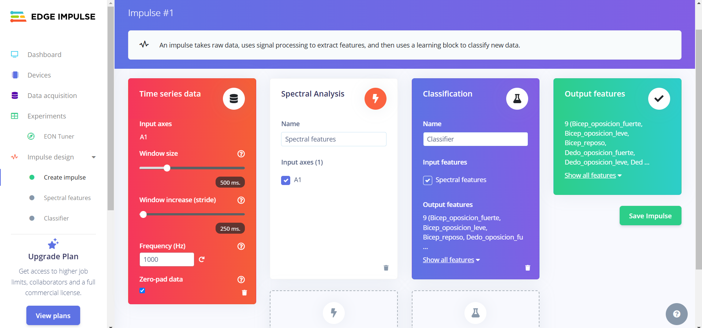

# Informe del Laboratorio de Edge Impulse
## Tabla de Contenidos

1. [Introducción](#1-introducción)
2. [Objetivos](#2-objetivos)
3. [Metodología](#3-metodología)
4. [Resultados](#4-resultados)

# 1. Introducción
Edge Impulse es una plataforma web diseñada específicamente para desarrollar modelos de aprendizaje automático (ML) que se ejecutan en dispositivos como microcontroladores, sensores, wearables y otro hardware con capacidad de procesamiento y memoria limitadas, simplificando la adquisición de datos al permitir a los desarrolladores recopilarlos y organizarlos directamente desde los dispositivos mencionados. Asimismo, esta plataforma contiene herramientas de procesamiento de señales y funciones que permiten extraer información significativa de los datos brutos de los sensores, con el fin de detectar patrones de movimiento a partir de las lecturas adquiridas. De esta manera, los modelos de aprendizaje automático pueden entrenarse directamente en Edge Impulse utilizando marcos populares como TensorFlow y ONNX, facilitando su uso en varios dispositivos, como Arduino, Raspberry Pi y placas STMicroelectronics.

En este informe, se detalla el proceso de clasificación de datos EMG utilizando la plataforma Edge Impulse. El objetivo fue analizar y clasificar señales EMG obtenidas en condiciones específicas, aprovechando herramientas de aprendizaje automático integradas en la plataforma.

El estudio se realizó con datos provenientes de grabaciones con un sistema OpenBCI, previamente segmentados y cargados en Edge Impulse para entrenamiento y validación.<div align="center">
  <p>
  </p>
</div>

# 2. Objetivos

## 2.1. Objetivo General
- Clasificar señales EMG mediante un modelo de aprendizaje automático desarrollado en Edge Impulse.

## 2.2. Objetivos Específicos
- Adquirir y organizar señales EMG según los diferentes ejercicios en un formato compatible para subirlos a Edge Impulse
- Segmentar y etiquetar las señales EMG según eventos específicos o estados, asegurando compatibilidad con Edge Impulse.
- Subir las señales preprocesadas a Edge Impulse y organizarlas en categorías claras para entrenamiento.
- Diseñar y entrenar un modelo de aprendizaje automático en Edge Impulse utilizando técnicas optimizadas para la clasificación de EEG.

# 3. Metodología
## 3.1. Descripción y Adquisición de los Datos

Para este laboratorio se usaron las señales EMG adquiridas durante el laboratorio N° usando el kit BITalino (r) evolution y el programa OpenSignal para la visualización y adquisición de la señal. 
De esta manera, se seleccionaron tres músculos clave para el análisis:

Bíceps braquial: Representativo de un músculo grande de la extremidad superior.
Gastrocnemio medial: Músculo principal de la pantorrilla involucrado en la locomoción.
Músculo del dedo: Representativo de una musculatura más pequeña y específica.

Además, para cada músculo, se analizaron tres condiciones experimentales:

Reposo: Estado basal sin contracción muscular.
Oposición leve: Contracción ligera o esfuerzo moderado.
Oposición fuerte: Contracción intensa o máxima.

Las señales presentaron una frecuencia de muestreo de 1000 Hz, con intervalos de tiempo que variaron entre 19 y 20 segundos, las cuales se exportaron como archivos txt.
<div align="center">
  <p>
  </p>
</div>

## 3.2.Procesamiento de los datos recopilados de la EMG

Las señales de EEG de cada actividad fueron procesadas y segmentadas utilizando un script en Python en fragmentos de 6 segundos, ya que esta es una duración estándar que permite capturar eventos fisiológicos importantes en la señal EEG mientras mantiene el tamaño de los archivos manejable, asegurando que todos los fragmentos tengan la misma longitud, lo cual es clave para entrenar modelos con entradas homogéneas. 
```
import numpy as np
import csv
import os

# Establece la frecuencia de muestreo (Hz)
Fs = 1000  # Frecuencia de muestreo (Ejemplo: 1000 Hz)
segment_duration = 2  # Duración de cada segmento en segundos
samples_per_segment = Fs * segment_duration  # Número de muestras por segmento
# Ruta de los archivos .txt
    #"C:\\Users\\sofmi\\OneDrive\\Desktop\\10MO CICLO\\INTRO SEÑALES\\DATA EMG\\bicep braquial en reposo II.txt",
    #"C:\\Users\\sofmi\\OneDrive\\Desktop\\10MO CICLO\\INTRO SEÑALES\\DATA EMG\\bicep braquial leve.txt",
    #"C:\\Users\\sofmi\\OneDrive\\Desktop\\10MO CICLO\\INTRO SEÑALES\\DATA EMG\\bicep braquial oposicion fuerte.txt",
    #"C:\\Users\\sofmi\\OneDrive\\Desktop\\10MO CICLO\\INTRO SEÑALES\\DATA EMG\\dedo en reposo.txt",
    #"C:\\Users\\sofmi\\OneDrive\\Desktop\\10MO CICLO\\INTRO SEÑALES\\DATA EMG\\oposicion leve.txt",
    #"C:\\Users\\sofmi\\OneDrive\\Desktop\\10MO CICLO\\INTRO SEÑALES\\DATA EMG\\oposicion fuerte.txt",
    #"C:\\Users\\sofmi\\OneDrive\\Desktop\\10MO CICLO\\INTRO SEÑALES\\DATA EMG\\gastrocnemio reposo II.txt",
    #"C:\\Users\\sofmi\\OneDrive\\Desktop\\10MO CICLO\\INTRO SEÑALES\\DATA EMG\\gastrocnemio leve.txt",
    #"C:\\Users\\sofmi\\OneDrive\\Desktop\\10MO CICLO\\INTRO SEÑALES\\DATA EMG\\gastrocnemio fuerte.txt",
file_paths = [

    "C:\\Users\\sofmi\\OneDrive\\Desktop\\10MO CICLO\\INTRO SEÑALES\\DATA EMG\\EMG_OTROS\\biceps_contra.txt",

    "C:\\Users\\sofmi\\OneDrive\\Desktop\\10MO CICLO\\INTRO SEÑALES\\DATA EMG\\EMG_OTROS\\biceps_reposo.txt",

    "C:\\Users\\sofmi\\OneDrive\\Desktop\\10MO CICLO\\INTRO SEÑALES\\DATA EMG\\EMG_OTROS\\biceps_voluntario.txt",
    "C:\\Users\\sofmi\\OneDrive\\Desktop\\10MO CICLO\\INTRO SEÑALES\\DATA EMG\\EMG_OTROS\\biceps1_reposo (1).txt",

    "C:\\Users\\sofmi\\OneDrive\\Desktop\\10MO CICLO\\INTRO SEÑALES\\DATA EMG\\EMG_OTROS\\biceps2_mov_voluntario.txt",

    "C:\\Users\\sofmi\\OneDrive\\Desktop\\10MO CICLO\\INTRO SEÑALES\\DATA EMG\\EMG_OTROS\\biceps3_mov_fuerza.txt",
    "C:\\Users\\sofmi\\OneDrive\\Desktop\\10MO CICLO\\INTRO SEÑALES\\DATA EMG\\EMG_OTROS\\dedo_contrs.txt",

    "C:\\Users\\sofmi\\OneDrive\\Desktop\\10MO CICLO\\INTRO SEÑALES\\DATA EMG\\EMG_OTROS\\dedo_reposo.txt",

    "C:\\Users\\sofmi\\OneDrive\\Desktop\\10MO CICLO\\INTRO SEÑALES\\DATA EMG\\EMG_OTROS\\dedo_volun.txt",
    "C:\\Users\\sofmi\\OneDrive\\Desktop\\10MO CICLO\\INTRO SEÑALES\\DATA EMG\\EMG_OTROS\\gastro1_reposo (1).txt",

    "C:\\Users\\sofmi\\OneDrive\\Desktop\\10MO CICLO\\INTRO SEÑALES\\DATA EMG\\EMG_OTROS\\gastro2_mov_voluntario.txt",

    "C:\\Users\\sofmi\\OneDrive\\Desktop\\10MO CICLO\\INTRO SEÑALES\\DATA EMG\\EMG_OTROS\\gastro3_mov_fuerza (1).txt",
] 
# Carpeta de salida para los archivos CSV
output_folder = "C:\\Users\\sofmi\\OneDrive\\Desktop\\10MO CICLO\\INTRO SEÑALES\\DATA EMG\\EMG_OTROS\\"

# Procesar cada archivo .txt
for file_path in file_paths:
    # Leer el archivo .txt y encontrar la línea de 'EndOfHeader'
    with open(file_path, 'r') as file:
        lines = file.readlines()
    # Buscar la línea que contiene 'EndOfHeader'
    data_start = None
    for i, line in enumerate(lines):
        if 'EndOfHeader' in line:
            data_start = i + 1
            break

    if data_start is None:
        raise ValueError(f"No se encontró 'EndOfHeader' en el archivo {file_path}.")
    # Extraer las líneas de datos (sin la parte del encabezado)
    data_lines = lines[data_start:]
    # Convertir las líneas de datos a un array de NumPy
    data = np.array([list(map(float, line.strip().split('\t'))) for line in data_lines])
    # Calcular la duración total de la señal en segundos
    num_rows = len(data)
    total_duration_seconds = num_rows / Fs
    # Imprimir información básica
    print(f"Procesando archivo: {file_path}")
    print(f"Frecuencia de muestreo: {Fs} Hz")
    print(f"Número total de filas: {num_rows}")
    print(f"Duración total de la señal en segundos: {total_duration_seconds} segundos")
    # Dividir los datos en segmentos de 2 segundos
    num_segments = num_rows // samples_per_segment
    # Generar archivos CSV para cada segmento
    for segment_idx in range(num_segments):
        # Obtener las filas para el segmento actual
        segment_data = data[segment_idx * samples_per_segment: (segment_idx + 1) * samples_per_segment]
        # Generar el nombre del archivo CSV
        file_name = os.path.basename(file_path).replace('.txt', f'_segment_{segment_idx + 1}.csv')
        output_file_path = os.path.join(output_folder, file_name)
        # Guardar el segmento de datos en un archivo CSV con el encabezado
        with open(output_file_path, mode='w', newline='') as csv_file:
            writer = csv.writer(csv_file)
            # Escribir el encabezado
            writer.writerow(["nSeq", "I1", "I2", "O1", "O2", "A1"])
            # Escribir los datos del segmento
            writer.writerows(segment_data)

        print(f"Guardado archivo CSV: {output_file_path}")
    print(f"Archivos CSV generados para: {file_path}\n")

  ```


Posteriormente se realizaron los siguientes pasos:
- Lee el archivo original que contiene la señal completa.
- Divide la señal en segmentos de 2 segundos, teniendo en cuenta una frecuencia de muestreo de 1000 Hz

<div align="center">
  <p>
  </p>
</div>

<div align="center">
  <p>
  </p>
</div>

- Exporta cada segmento como un archivo CSV independiente, listo para subir a Edge Impulse, ya que este es el formato en el cual trabaja la plataforma, al igual con los archivos de tipo json.

<div align="center">
  <p>
  </p>
</div>

## 3.3. Creación y configuración del Impulse

El Impulse organiza el flujo desde la entrada de datos hasta el modelo de aprendizaje automático. Este paso define cómo los datos crudos serán transformados en características que alimentarán al modelo.
El Impulse fue diseñado para procesar las señales EMG de manera eficiente, siguiendo los siguientes parámetros:

- Ventana de Tiempo (Window Size): Se utilizó un tamaño de ventana de 500 ms, con el fin de segmentar la señal en fragmentos temporales que capturen adecuadamente los patrones musculares relevantes en cada ejercicio. Este valor es ideal para registrar eventos musculares como contracciones y relajaciones rápidas.

- Incremento de Ventana (Window Increase): Se configuró un desplazamiento de 250 ms entre ventanas, generando un solapamiento del 50%. Esto permitió aumentar el número de segmentos disponibles para el entrenamiento del modelo y reducir la pérdida de información entre ventanas consecutivas.

- Frecuencia de Muestreo: Los datos fueron capturados a una frecuencia de 1000 Hz, asegurando una resolución temporal suficiente para registrar los rápidos cambios en las señales EMG.

- Relleno con Ceros (Zero-pad data): Se activó esta opción para garantizar que todas las ventanas sean del mismo tamaño, rellenando con ceros en caso de segmentos incompletos.

Asimismo, se añadió un bloque de procesamiento basado en Análisis Espectral para extraer características del dominio de la frecuencia.

- Características Espectrales: Se configuraron para analizar la señal en el eje A1 (dato principal de entrada). Este enfoque permitió transformar las señales crudas en el dominio de frecuencia, identificando patrones representativos de cada actividad muscular. Debido a que las señales EMG contienen información relevante en bandas específicas de frecuencia debido a la activación de fibras musculares, el análisis espectral permite identificar los componentes armónicos, ruido, y patrones que diferencian actividades musculares como reposo, oposición leve y fuerte.


Configuración del Impulse
El Impulse fue diseñado para procesar las señales EMG de manera eficiente, siguiendo los siguientes parámetros:

Ventana de Tiempo (Window Size): Se utilizó un tamaño de ventana de 500 ms, con el fin de segmentar la señal en fragmentos temporales que capturen adecuadamente los patrones musculares relevantes en cada ejercicio. Este valor es ideal para registrar eventos musculares como contracciones y relajaciones rápidas.

Incremento de Ventana (Window Increase): Se configuró un desplazamiento de 250 ms entre ventanas, generando un solapamiento del 50%. Esto permitió aumentar el número de segmentos disponibles para el entrenamiento del modelo y reducir la pérdida de información entre ventanas consecutivas.

Frecuencia de Muestreo: Los datos fueron capturados a una frecuencia de 1000 Hz, asegurando una resolución temporal suficiente para registrar los rápidos cambios en las señales EMG.

Relleno con Ceros (Zero-pad data): Se activó esta opción para garantizar que todas las ventanas sean del mismo tamaño, rellenando con ceros en caso de segmentos incompletos.

Bloque de Procesamiento: Análisis Espectral
Se añadió un bloque de procesamiento basado en Análisis Espectral para extraer características del dominio de la frecuencia.

Características Espectrales: Se configuraron para analizar la señal en el eje A1 (dato principal de entrada). Este enfoque permitió transformar las señales crudas en el dominio de frecuencia, identificando patrones representativos de cada actividad muscular.

Por último, se añadió un bloque de clasificación para entrenar el modelo y asignar las señales a una de las 9 clases definidas (Bíceps y Dedo en reposo, oposición leve y fuerte, y Gastrocnemio en las mismas categorías).

- Entrada: Este bloque recibió las Características Espectrales generadas en el paso anterior como insumos para el aprendizaje.

- Salida: El modelo fue configurado para clasificar cada ventana en una de las 9 clases musculares específicas. Esto permitió que el modelo aprendiera a distinguir las diferencias entre los ejercicios realizados por cada músculo.


| **Configuración de parametros del Impulse** | 
|| 


Una vez creado el proyecto, se accedió a la pestaña "Data Acquisition" para poder subir nuestros datos.
<div align="center">
  <p>
  </p>
</div>

Antes de subir los datos, se seleccionó la opción "CSV wizard". Este paso es fundamental para asegurar que los archivos CSV sean compatibles con los requerimientos de la plataforma y estén correctamente formateados.

<div align="center">
  <p>
  </p>
</div>

Se seleccionaron los archivos CSV generados previamente, cada archivo representando un segmento de 6 segundos de señal EEG, verificando que se subio correctamente.

<div align="center">
  <p>
  </p>
</div>

Ahora se configura las delimitaciones del archivo, para poder identificar y separar los datos, según su número de secuencia y su valor de amplitud. Como los datos se estan separando por comas, esta se selecciona como separador, además se destaca que al colocar el nuevo encabezado la plataforma logra identificar de mejor manera la columna de cada tipo de dato según su nombre, para garantizar una interpretación uniforme de los datos.

<div align="center">
  <p>
  </p>
</div>

Una vez configurado la delimitación y los encabezados, continuamos seleccionando "Yes, this is time-series data", debido a que los datos son secuenciales y se registraron a lo largo del tiempo. También se selecciona "Each row contains a reading, and sensor values are columns", ya que esta opción es común cuando cada fila del archivo representa una lectura única, y las columnas contienen varios datos. Esto permite trabajar con datos multivariables registrados simultáneamente. Esto es esencial para proyectos que requieren análisis de patrones en el tiempo, como clasificación de movimientos o procesamiento de señales.

<div align="center">
  <p>
  </p>
</div>


Asimismo, se establece la frecuencia de muestreo en 1000 Hz, correspondiente al intervalo con el que se registraron los datos, asegurando la integridad del análisis.
<div align="center">
  <p>
  </p>
</div>

Posteriormente, se selecciona la columna del archivo que contiene los datos relevantes, como las señales o información específica a procesar.
<div align="center">
  <p>
  </p>
</div>

Como la duración de las muestras fue definida en el código, ya que la señal fue previemente procesada en segmentos de 6 segundos,  se selecciona la opción "Unlimited" en el campo "How long do you want your samples to be", permitiendo que las muestras se procesen sin restricciones de longitud.
<div align="center">
  <p>
  </p>
</div>


Confirma la configuración final. Aparecerá un mensaje indicando que cualquier archivo CSV cargado en el proyecto será procesado según las reglas definidas, asegurando la uniformidad en el tratamiento de los datos.
<div align="center">
  <p>
  </p>
</div>


Ahora vamos a la opción "Upload Data" y subimos el archivo CSV procesado, colocandole un nombre definido en "Label", ya que si los datos contienen varias clases,  incluir etiquetas diferenciadas para cada categoría dentro del archivo CSV, o asignarlas después de subir los datos. De esta manera los datos estarán correctamente organizados y listos para el entrenamiento del modelo, donde se puede evaluar su balance.

<div align="center">
  <p>
  <p>
  </p>
</div>

De esta manera, subimos los segmentos de nuestras señales, los cuales se pueden visualizar en el cuadro derecho. Asimismo, si se requiere renombrar el archivo o cambiar la etiqueta, al seleccionar los tres puntos donde se encuentra el archivo se podrá ver las opciones para realizar los cambios.
<div align="center">
  <p>
  <p>
  <p>
  <p>
  </p>
</div>

Finalmente se obtuvieron, los siguientes resultados del balanceo:
Link de proyecto: https://studio.edgeimpulse.com/public/558174/live

<div align="center">
  <p>
  <p>
  <p>
  </p>
</div>

