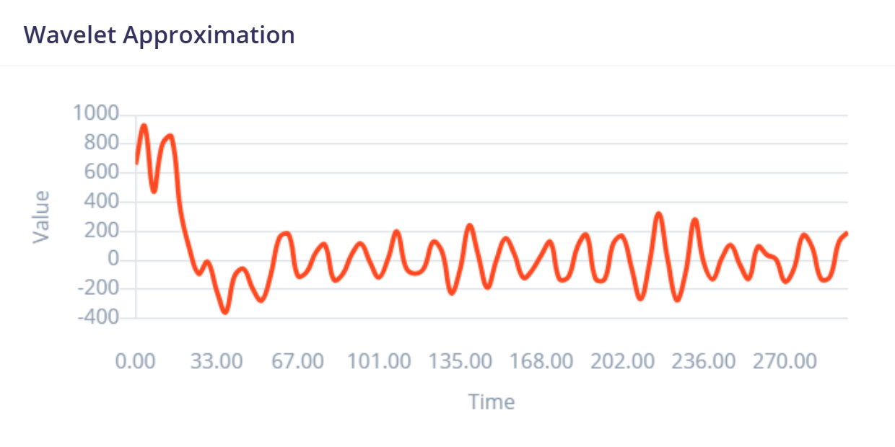

# Informe del Laboratorio de Edge Impulse
## Tabla de Contenidos

1. [Introducción](#1-introducción)
2. [Objetivos](#2-objetivos)
3. [Metodología](#3-metodología)
4. [Resultados](#4-resultados)

# 1. Introducción
Edge Impulse es una plataforma web diseñada específicamente para desarrollar modelos de aprendizaje automático (ML) que se ejecutan en dispositivos como microcontroladores, sensores, wearables y otro hardware con capacidad de procesamiento y memoria limitadas, simplificando la adquisición de datos al permitir a los desarrolladores recopilarlos y organizarlos directamente desde los dispositivos mencionados. Asimismo, esta plataforma contiene herramientas de procesamiento de señales y funciones que permiten extraer información significativa de los datos brutos de los sensores, con el fin de detectar patrones de movimiento a partir de las lecturas adquiridas. De esta manera, los modelos de aprendizaje automático pueden entrenarse directamente en Edge Impulse utilizando marcos populares como TensorFlow y ONNX, facilitando su uso en varios dispositivos, como Arduino, Raspberry Pi y placas STMicroelectronics.

En este informe, se detalla el proceso de clasificación de datos EMG utilizando la plataforma Edge Impulse. El objetivo fue analizar y clasificar señales EMG obtenidas en condiciones específicas, aprovechando herramientas de aprendizaje automático integradas en la plataforma.

El estudio se realizó con datos provenientes de grabaciones con un sistema OpenBCI, previamente segmentados y cargados en Edge Impulse para entrenamiento y validación.

# 2. Objetivos

## 2.1. Objetivo General
- Clasificar señales EMG mediante un modelo de aprendizaje automático desarrollado en Edge Impulse.

## 2.2. Objetivos Específicos
- Adquirir y organizar señales EMG según los diferentes ejercicios en un formato compatible para subirlos a Edge Impulse
- Segmentar y etiquetar las señales EMG según eventos específicos o estados, asegurando compatibilidad con Edge Impulse.
- Subir las señales preprocesadas a Edge Impulse y organizarlas en categorías claras para entrenamiento.
- Diseñar y entrenar un modelo de aprendizaje automático en Edge Impulse utilizando técnicas optimizadas para la clasificación de EEG.

# 3. Metodología
## 3.1. Descripción y Adquisición de los Datos

Para este laboratorio se usaron las señales EMG adquiridas durante el laboratorio N° usando el kit BITalino (r) evolution y el programa OpenSignal para la visualización y adquisición de la señal. 
De esta manera, se seleccionaron tres músculos clave para el análisis:

Bíceps braquial: Representativo de un músculo grande de la extremidad superior.
Gastrocnemio medial: Músculo principal de la pantorrilla involucrado en la locomoción.
Músculo del dedo: Representativo de una musculatura más pequeña y específica.

Además, para cada músculo, se analizaron tres condiciones experimentales:

Reposo: Estado basal sin contracción muscular.
Oposición leve: Contracción ligera o esfuerzo moderado.
Oposición fuerte: Contracción intensa o máxima.

Las señales presentaron una frecuencia de muestreo de 1000 Hz, con intervalos de tiempo que variaron entre 19 y 20 segundos, las cuales se exportaron como archivos txt.
<div align="center">
  <p>
  </p>
</div>

## 3.2.Procesamiento de los datos recopilados de la EMG

Las señales de EEG de cada actividad fueron procesadas y segmentadas utilizando un script en Python en fragmentos de 6 segundos, ya que esta es una duración estándar que permite capturar eventos fisiológicos importantes en la señal EEG mientras mantiene el tamaño de los archivos manejable, asegurando que todos los fragmentos tengan la misma longitud, lo cual es clave para entrenar modelos con entradas homogéneas. 
```
import numpy as np
import csv
import os

# Establece la frecuencia de muestreo (Hz)
Fs = 1000  # Frecuencia de muestreo (Ejemplo: 1000 Hz)
segment_duration = 2  # Duración de cada segmento en segundos
samples_per_segment = Fs * segment_duration  # Número de muestras por segmento
# Ruta de los archivos .txt
    #"C:\\Users\\sofmi\\OneDrive\\Desktop\\10MO CICLO\\INTRO SEÑALES\\DATA EMG\\bicep braquial en reposo II.txt",
    #"C:\\Users\\sofmi\\OneDrive\\Desktop\\10MO CICLO\\INTRO SEÑALES\\DATA EMG\\bicep braquial leve.txt",
    #"C:\\Users\\sofmi\\OneDrive\\Desktop\\10MO CICLO\\INTRO SEÑALES\\DATA EMG\\bicep braquial oposicion fuerte.txt",
    #"C:\\Users\\sofmi\\OneDrive\\Desktop\\10MO CICLO\\INTRO SEÑALES\\DATA EMG\\dedo en reposo.txt",
    #"C:\\Users\\sofmi\\OneDrive\\Desktop\\10MO CICLO\\INTRO SEÑALES\\DATA EMG\\oposicion leve.txt",
    #"C:\\Users\\sofmi\\OneDrive\\Desktop\\10MO CICLO\\INTRO SEÑALES\\DATA EMG\\oposicion fuerte.txt",
    #"C:\\Users\\sofmi\\OneDrive\\Desktop\\10MO CICLO\\INTRO SEÑALES\\DATA EMG\\gastrocnemio reposo II.txt",
    #"C:\\Users\\sofmi\\OneDrive\\Desktop\\10MO CICLO\\INTRO SEÑALES\\DATA EMG\\gastrocnemio leve.txt",
    #"C:\\Users\\sofmi\\OneDrive\\Desktop\\10MO CICLO\\INTRO SEÑALES\\DATA EMG\\gastrocnemio fuerte.txt",
file_paths = [

    "C:\\Users\\sofmi\\OneDrive\\Desktop\\10MO CICLO\\INTRO SEÑALES\\DATA EMG\\EMG_OTROS\\biceps_contra.txt",

    "C:\\Users\\sofmi\\OneDrive\\Desktop\\10MO CICLO\\INTRO SEÑALES\\DATA EMG\\EMG_OTROS\\biceps_reposo.txt",

    "C:\\Users\\sofmi\\OneDrive\\Desktop\\10MO CICLO\\INTRO SEÑALES\\DATA EMG\\EMG_OTROS\\biceps_voluntario.txt",
    "C:\\Users\\sofmi\\OneDrive\\Desktop\\10MO CICLO\\INTRO SEÑALES\\DATA EMG\\EMG_OTROS\\biceps1_reposo (1).txt",

    "C:\\Users\\sofmi\\OneDrive\\Desktop\\10MO CICLO\\INTRO SEÑALES\\DATA EMG\\EMG_OTROS\\biceps2_mov_voluntario.txt",

    "C:\\Users\\sofmi\\OneDrive\\Desktop\\10MO CICLO\\INTRO SEÑALES\\DATA EMG\\EMG_OTROS\\biceps3_mov_fuerza.txt",
    "C:\\Users\\sofmi\\OneDrive\\Desktop\\10MO CICLO\\INTRO SEÑALES\\DATA EMG\\EMG_OTROS\\dedo_contrs.txt",

    "C:\\Users\\sofmi\\OneDrive\\Desktop\\10MO CICLO\\INTRO SEÑALES\\DATA EMG\\EMG_OTROS\\dedo_reposo.txt",

    "C:\\Users\\sofmi\\OneDrive\\Desktop\\10MO CICLO\\INTRO SEÑALES\\DATA EMG\\EMG_OTROS\\dedo_volun.txt",
    "C:\\Users\\sofmi\\OneDrive\\Desktop\\10MO CICLO\\INTRO SEÑALES\\DATA EMG\\EMG_OTROS\\gastro1_reposo (1).txt",

    "C:\\Users\\sofmi\\OneDrive\\Desktop\\10MO CICLO\\INTRO SEÑALES\\DATA EMG\\EMG_OTROS\\gastro2_mov_voluntario.txt",

    "C:\\Users\\sofmi\\OneDrive\\Desktop\\10MO CICLO\\INTRO SEÑALES\\DATA EMG\\EMG_OTROS\\gastro3_mov_fuerza (1).txt",
] 
# Carpeta de salida para los archivos CSV
output_folder = "C:\\Users\\sofmi\\OneDrive\\Desktop\\10MO CICLO\\INTRO SEÑALES\\DATA EMG\\EMG_OTROS\\"

# Procesar cada archivo .txt
for file_path in file_paths:
    # Leer el archivo .txt y encontrar la línea de 'EndOfHeader'
    with open(file_path, 'r') as file:
        lines = file.readlines()
    # Buscar la línea que contiene 'EndOfHeader'
    data_start = None
    for i, line in enumerate(lines):
        if 'EndOfHeader' in line:
            data_start = i + 1
            break

    if data_start is None:
        raise ValueError(f"No se encontró 'EndOfHeader' en el archivo {file_path}.")
    # Extraer las líneas de datos (sin la parte del encabezado)
    data_lines = lines[data_start:]
    # Convertir las líneas de datos a un array de NumPy
    data = np.array([list(map(float, line.strip().split('\t'))) for line in data_lines])
    # Calcular la duración total de la señal en segundos
    num_rows = len(data)
    total_duration_seconds = num_rows / Fs
    # Imprimir información básica
    print(f"Procesando archivo: {file_path}")
    print(f"Frecuencia de muestreo: {Fs} Hz")
    print(f"Número total de filas: {num_rows}")
    print(f"Duración total de la señal en segundos: {total_duration_seconds} segundos")
    # Dividir los datos en segmentos de 2 segundos
    num_segments = num_rows // samples_per_segment
    # Generar archivos CSV para cada segmento
    for segment_idx in range(num_segments):
        # Obtener las filas para el segmento actual
        segment_data = data[segment_idx * samples_per_segment: (segment_idx + 1) * samples_per_segment]
        # Generar el nombre del archivo CSV
        file_name = os.path.basename(file_path).replace('.txt', f'_segment_{segment_idx + 1}.csv')
        output_file_path = os.path.join(output_folder, file_name)
        # Guardar el segmento de datos en un archivo CSV con el encabezado
        with open(output_file_path, mode='w', newline='') as csv_file:
            writer = csv.writer(csv_file)
            # Escribir el encabezado
            writer.writerow(["nSeq", "I1", "I2", "O1", "O2", "A1"])
            # Escribir los datos del segmento
            writer.writerows(segment_data)

        print(f"Guardado archivo CSV: {output_file_path}")
    print(f"Archivos CSV generados para: {file_path}\n")

  ```

Posteriormente se realizaron los siguientes pasos:
- Lee el archivo original que contiene la señal completa.
- Divide la señal en segmentos de 2 segundos, teniendo en cuenta una frecuencia de muestreo de 1000 Hz
- Exporta cada segmento como un archivo CSV independiente, listo para subir a Edge Impulse, ya que este es el formato en el cual trabaja la plataforma, al igual con los archivos de tipo json.

<div align="center">
  <p>
  </p>
</div>

## 3.3. Creación y configuración del Impulse

El Impulse organiza el flujo desde la entrada de datos hasta el modelo de aprendizaje automático. Este paso define cómo los datos crudos serán transformados en características que alimentarán al modelo.
El Impulse fue diseñado para procesar las señales EMG de manera eficiente, siguiendo los siguientes parámetros:

- Ventana de Tiempo (Window Size): Se utilizó un tamaño de ventana de 500 ms, con el fin de segmentar la señal en fragmentos temporales que capturen adecuadamente los patrones musculares relevantes en cada ejercicio. Este valor es ideal para registrar eventos musculares como contracciones y relajaciones rápidas.

- Incremento de Ventana (Window Increase): Se configuró un desplazamiento de 250 ms entre ventanas, generando un solapamiento del 50%. Esto permitió aumentar el número de segmentos disponibles para el entrenamiento del modelo y reducir la pérdida de información entre ventanas consecutivas.

- Frecuencia de Muestreo: Los datos fueron capturados a una frecuencia de 1000 Hz, asegurando una resolución temporal suficiente para registrar los rápidos cambios en las señales EMG.

- Relleno con Ceros (Zero-pad data): Se activó esta opción para garantizar que todas las ventanas sean del mismo tamaño, rellenando con ceros en caso de segmentos incompletos.

Asimismo, se añadió un bloque de procesamiento basado en Análisis Espectral para extraer características del dominio de la frecuencia.

- Características Espectrales: Se configuraron para analizar la señal en el eje A1 (dato principal de entrada). Este enfoque permitió transformar las señales crudas en el dominio de frecuencia, identificando patrones representativos de cada actividad muscular. Debido a que las señales EMG contienen información relevante en bandas específicas de frecuencia debido a la activación de fibras musculares, el análisis espectral permite identificar los componentes armónicos, ruido, y patrones que diferencian actividades musculares como reposo, oposición leve y fuerte.

Por último, se añadió un bloque de clasificación para entrenar el modelo y asignar las señales a una de las 9 clases definidas (Bíceps y Dedo en reposo, oposición leve y fuerte, y Gastrocnemio en las mismas categorías).

- Entrada: Este bloque recibió las Características Espectrales generadas en el paso anterior como insumos para el aprendizaje.

- Salida: El modelo fue configurado para clasificar cada ventana en una de las 9 clases musculares específicas. Esto permitió que el modelo aprendiera a distinguir las diferencias entre los ejercicios realizados por cada músculo.


| **Configuración de parametros del Impulse** | 
|| 

## 3.4.  Configuración General del Bloque de Características Espectrales
En este apartado se personaliza la extracción de características espectrales para analizar la señal sEMG de reposo del dedo. Los parámetros seleccionados son:

A. **CASO 1**

- Scale axes: Se colocó un valor de 1, lo que significa que no se realiza escalamiento adicional a los datos. Esto garantiza que las características sean representativas de la señal original sin modificaciones externas.
- Input Decimation Ratio: También se estableció en 1, lo que implica que no se reduce la cantidad de datos de entrada. Este ajuste asegura que no se pierda información relevante durante la extracción de características.

| **Configuración de parametros** | 
|| 

| **Configuración de Generación de Características** | 
|| 

- Tipo de filtro: Se seleccionó un filtro High-pass filter. Este tipo de filtro elimina componentes de baja frecuencia de la señal, que usualmente corresponden a ruido o artefactos indeseados, como movimiento no intencional del dedo.
- Frecuencia de corte: La frecuencia de corte se configuró en 15 Hz, permitiendo que solo las frecuencias superiores a este valor se consideren en el análisis, ya que las señales EMG generadas por la actividad muscular  se encuentran principalmente entre 20 y 500 Hz, con la mayor parte de la energía concentrada en frecuencias entre 50 y 150 Hz, dependiendo del músculo y la contracción.
- Orden: Se utilizó un filtro de segundo orden (2), lo cual proporciona un buen equilibrio entre la precisión del filtrado y la estabilidad de la señal procesada.
Método: Se utilizó el análisis Wavelet. Este método es ideal para señales biomédicas, ya que permite analizar tanto el tiempo como la frecuencia simultáneamente.

Wavelet seleccionado: Se eligió la familia db4 (Daubechies 4), conocida por su capacidad de representar señales con transiciones rápidas, como las presentes en sEMG.
- Nivel de descomposición: Se configuró en 2, dividiendo la señal en componentes que representan frecuencias más bajas y más altas, útiles para identificar patrones específicos.

| **Ploteo de Filtro** | 
|| 

| **Ploteo de wavelet** | 
|| 


**Dedo en Reposo**

| **Señal después del Filtro** | 
|| 

| **Señal aproximada con Wavelet** | 
|| 

**Dedo con Leve Oposición**

| **Señal después del Filtro** | 
|| 

| **Señal aproximada con Wavelet** | 
|| 

**Dedo con Oposición Fuerte**

| **Señal después del Filtro** | 
|| 

| **Señal aproximada con Wavelet** | 
|| 


**Bícep en Reposo**

| **Señal después del Filtro** | 
|| 

| **Señal aproximada con Wavelet** | 
|| 

**Bícep con Leve Oposición**

| **Señal después del Filtro** | 
|| 

| **Señal aproximada con Wavelet** | 
|| 

**Bícep con Oposición Fuerte**

| **Señal después del Filtro** | 
|| 

| **Señal aproximada con Wavelet** | 
|| 


**Gastrocnemio en Reposo**

| **Señal después del Filtro** | 
|| 

| **Señal aproximada con Wavelet** | 
|| 

**Gastrocnemio con Leve Oposición**

| **Señal después del Filtro** | 
|| 

| **Señal aproximada con Wavelet** | 
|| 

**Gastrocnemio con Oposición Fuerte**
| **Señal después del Filtro** | 
|| 

| **Señal aproximada con Wavelet** | 
|| 


B.**CASO 2**
Se utilizó la Transformada Rápida de Fourier (FFT) para convertir las señales del dominio temporal al dominio de frecuencia, ya que la FFT permite identificar de forma eficiente las frecuencias dominantes en las señales EMG, siendo realmente útil para la clasificación de las actividades musculares, ya que:
- En reposo, la señal tiene poca energía y las frecuencias altas están mínimamente representadas.
- En oposición leve, comienzan a aparecer componentes de frecuencia más altas debido a la contracción muscular.
- En oposición fuerte, aumenta la energía en frecuencias superiores, indicando mayor actividad muscular.
<div align="center">
  <p>
  </p>
</div>

B.1. Resolución espectral
Se seleccionó una longitud de 1024 puntos para obtener una buena resolución espectral. Esto permite distinguir frecuencias cercanas, lo cual es crítico para identificar patrones asociados a diferentes intensidades de contracción.

B.2. Preservación de la escala lineal
No se tomó el logaritmo del espectro para mantener una representación directa de la energía espectral, lo cual es útil para diferenciar niveles de activación muscular, ya que la relación entre intensidad de contracción y energía espectral es aproximadamente lineal.


| **Dedo en Reposo** | 
|| 

|**Dedo con Oposición Leve**| 
|| 

| **Dedo con Oposición Fuerte** | 
|| 


| **Bícep en Reposo** | 
|| 

|**Bícep con Oposición Leve**| 
|| 

| **Bícep con Oposición Fuerte** | 
|| 


| **Gastrocnemio en Reposo** | 
|| 

|**Gastrocnemio con Oposición Leve**| 
|| 

| **Gastrocnemio con Oposición Fuerte** | 
|| 

## 3.5. Configuración y Entrenamiento de la Red Neuronal para la Clasificación de Señales EMG
Finalmente, se describe la configuración de la arquitectura y los parámetros de entrenamiento de una red neuronal diseñada para clasificar señales electromiográficas (EMG) en nueve clases, correspondientes a distintas combinaciones de músculos y actividades analizadas. La red neuronal fue optimizada para aprovechar las características espectrales previamente extraídas, maximizando el desempeño del modelo en términos de precisión y eficiencia.

**CASO 2**

El entrenamiento del modelo con FFT se configuró cuidadosamente para optimizar la convergencia y minimizar el error, evitando problemas como el sobreajuste o la suboptimización.

B.1. Parámetros principales del entrenamiento

Se eligió un número de ciclos de entrenamiento de 235, basándose en pruebas preliminares que mostraron que esta cantidad de ciclos permitía la convergencia del modelo, evitando tanto un ajuste insuficiente como un sobreentrenamiento. Además, se selecciono una tasa de aprendizaje (learning rate) de 0.0005, ya que una tasa de aprendizaje baja fue seleccionada para garantizar actualizaciones suaves de los pesos de la red, mejorando la precisión del modelo y evitando oscilaciones o saltos grandes en el espacio de parámetros.

<div align="center">
  <p>
  </p>
</div>

A continuación, se detalla el análisis del desempeño del modelo, la interpretación de sus métricas y las recomendaciones para mejorar su rendimiento.


| **Accuracy y matriz de confusión** | 
|| 
|**Métricas**| 
|| 

La precisión global del modelo sobre el conjunto de validación fue del 59.6%, lo cual indica que el modelo clasifica correctamente aproximadamente seis de cada diez instancias. Si bien esto demuestra que el modelo tiene cierto nivel de aprendizaje, también sugiere que existen dificultades significativas para diferenciar entre ciertas clases. Asimismo, la pérdida del modelo fue de 1.23, lo cual puede deberse a múltiples factores, como la complejidad de las señales EMG, solapamiento entre clases, insuficiencia en las características extraídas o limitaciones en la arquitectura de la red neuronal.

Mientras, que en la matriz de confusión permite un análisis detallado del desempeño del modelo en cada clase específica. Entre las clases mejor clasificadas, destacan:

- Dedo oposición fuerte con un porcentaje de aciertos del 87.5%, y
- Dedo oposición leve con un acierto del 83.3%.

Estas altas tasas de precisión pueden atribuirse a que las actividades en el dedo generan patrones EMG más distintivos, posiblemente debido a un mayor aislamiento muscular en comparación con el gastrocnemio y el bíceps. Estas actividades generan señales con amplitudes y distribuciones espectrales más específicas, facilitando su clasificación.

Por el contrario, las clases con el desempeño más bajo fueron:

- Gastro reposo con un acierto del 43.5%, y
- Gastro oposición leve con un acierto del 47.5%.

Estas clases muestran un nivel significativo de confusión con otras actividades del gastrocnemio. Esto podría deberse a que las señales en reposo tienen amplitudes bajas y poca variabilidad espectral, lo que dificulta su diferenciación. Asimismo, las actividades leves podrían generar patrones que se solapan con las actividades de reposo o incluso con las actividades de oposición fuerte, especialmente si las contracciones musculares no son consistentemente intensas entre las repeticiones.

Un análisis adicional revela que existe una confusión recurrente entre las actividades del bíceps oposición fuerte y gastro oposición fuerte, lo que puede explicarse por la similitud en las frecuencias y amplitudes dominantes de las señales cuando ambos músculos están altamente activados. 
