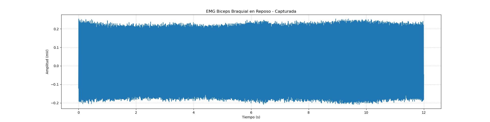

# INFORME LABORATORIO 8 - TRANSFORMADA WAVELET 

## Tabla de Contenidos

1. [Introducción](#1-introducción)
2. [Marco teórico](#2-marco-teórico)
3. [Objetivos](#3-objetivos)
4. [Materiales y equipos](#4-materiales-y-equipos)
5. [Metodología](#5-metodología)
6. [Resultados y discusiones](#6-resultados-y-discusiones)
7. [Conclusiones](#7-conclusiones)
8. [Referencias bibliográficas](#8-referencias-bibliográficas)

## 1. Introducción

En el ámbito de la ingeniería biomédica, el procesamiento de señales biomédicas juega un papel fundamental para el análisis, diagnóstico y monitoreo de diversas condiciones clínicas. Las señales biomédicas como el electrocardiograma (ECG), electromiograma (EMG) y electroencefalograma (EEG) contienen información valiosa sobre el estado fisiológico de los sistemas cardiovascular, muscular y cerebral, respectivamente. Sin embargo, estas señales suelen estar contaminadas por ruido y artefactos, lo que dificulta su análisis directo. En este contexto, las transformadas matemáticas, específicamente la transformada wavelet, han emergido como una herramienta poderosa para el procesamiento y análisis de estas señales complejas.

La transformada wavelet permite descomponer una señal en componentes de frecuencia y tiempo, lo que resulta en una representación multiresolución que es especialmente útil para la detección de eventos transitorios y la identificación de características en señales no estacionarias, como las biomédicas. A diferencia de la transformada de Fourier, que solo ofrece una visión global de la frecuencia, la transformada wavelet ofrece una flexibilidad adicional para estudiar señales con componentes de baja y alta frecuencia en diferentes momentos, lo cual es esencial para detectar anomalías en señales biomédicas [1]. En aplicaciones como el ECG, se ha demostrado que las transformadas wavelet son efectivas para la eliminación de ruido de alta frecuencia y para la detección de complejos QRS [2]. De igual manera, en el análisis de EMG, las wavelets permiten separar con precisión los patrones de activación muscular de los artefactos de movimiento [3], y en el caso del EEG, facilitan la identificación de ondas cerebrales anormales asociadas con epilepsia o trastornos del sueño [4].

En este informe, se abordará el uso de las transformadas wavelet en el procesamiento de señales biomédicas, con un enfoque en las señales ECG, EMG y EEG. Se discutirán los beneficios y limitaciones de su aplicación, así como ejemplos específicos de su implementación en estudios recientes.

## 2. Marco teórico

**2.1 ¿Qué es la transformada de Wavelet?**

La transformada de Wavelet es una herramienta matemática utilizada para el análisis de señales no estacionarias. Permite descomponer una señal en distintos niveles de frecuencia y tiempo, manteniendo la ubicación temporal de sus características. A diferencia de la transformada de Fourier, que solo proporciona información en el dominio de la frecuencia, la transformada de Wavelet ofrece un análisis multiresolución, lo que la hace ideal para estudiar señales con variaciones abruptas o transitorias​   .

**2.2 ¿Cuáles son sus características?**
   

La transformada de Wavelet tiene varias características que la hacen adecuada para el análisis de señales no estacionarias​   :

- **Localización tiempo-frecuencia**: A diferencia de la transformada de Fourier, la transformada de Wavelet permite analizar una señal en ambos dominios, temporal y frecuencial, lo cual es crucial para señales que cambian a lo largo del tiempo. Esta técnica divide la señal en componentes de frecuencia, mientras conserva la información temporal, lo que facilita la identificación de cuándo ocurren eventos específicos en la señal​.
  
- **Análisis multiresolución**: La transformada Wavelet puede realizar análisis a diferentes escalas, utilizando ventanas amplias para bajas frecuencias y ventanas más pequeñas para altas frecuencias. Esto es útil para el análisis de señales como EEG, ECG o EMG, donde los eventos pueden variar en frecuencia y duración​.

- **Adaptabilidad**: La Wavelet ajusta dinámicamente el tamaño de la ventana de análisis según la frecuencia de la señal. Para bajas frecuencias, utiliza ventanas más largas, y para altas frecuencias, ventanas más cortas, lo que mejora la precisión temporal​.

- **Detección de transitorios**: Es especialmente efectiva para identificar eventos cortos y abruptos en una señal, como picos o rupturas, lo que es útil en áreas como la sismología, medicina o ingeniería eléctrica​.

- **Invertibilidad**: La transformada de Wavelet es invertible, lo que permite reconstruir la señal original a partir de sus coeficientes sin pérdida de información, siempre que no se alteren​.

**2.3 ¿Cuál es su clasificación?**

La transformada de Wavelet se clasifica en varias modalidades según su implementación y aplicación en el análisis de señales​   :

- **Transformada Wavelet Continua (CWT)**: Proporciona una representación detallada de la señal en escalas continuas de tiempo y frecuencia. Aunque es muy precisa, genera una gran cantidad de datos redundantes, lo que la hace menos eficiente en términos de procesamiento y almacenamiento​.

- **Transformada Wavelet Discreta (DWT)**: Utiliza un conjunto discreto de escalas y posiciones, lo que reduce la redundancia y mejora la eficiencia. La DWT es comúnmente usada en el procesamiento de señales biomédicas y en la compresión de datos​.

- **Transformada Wavelet Estacionaria (SWT)**: Es una variante de la DWT que no submuestrea la señal, lo que mantiene la localización temporal sin pérdida de datos por desplazamiento, aunque aumenta la redundancia y los requerimientos de procesamiento​.

- **Wavelet Shrinkage**: Este método se usa para la eliminación de ruido en señales. Aplica umbrales a los coeficientes de Wavelet para eliminar aquellos que contienen ruido, conservando los que representan la señal útil, siendo ideal para señales como ECG o EEG​.

## 3. Objetivos

### Objetivo general
Evaluar el uso de la transformada wavelet en el procesamiento de señales biomédicas, específicamente en señales de electrocardiograma (ECG), electromiograma (EMG) y electroencefalograma (EEG), con el fin de optimizar la detección de patrones fisiológicos y patológicos.

### Objetivos específicos
1. **Analizar la aplicación de la transformada wavelet en el procesamiento de señales ECG** para la identificación y detección precisa de los complejos QRS y eliminación de artefactos de ruido.
   
2. **Explorar el uso de la transformada wavelet en señales EMG** para separar patrones de activación muscular de artefactos y ruido, permitiendo un análisis más robusto de la actividad muscular en diferentes condiciones fisiológicas.

3. **Investigar la implementación de la transformada wavelet en señales EEG** para la identificación de eventos transitorios y anómalos, como ondas cerebrales características en condiciones como la epilepsia.

4. **Revisar estudios previos y actuales** sobre la aplicación de la transformada wavelet en señales biomédicas, para identificar mejoras potenciales en algoritmos de procesamiento que puedan ser implementados en dispositivos biomédicos de diagnóstico.

## 4. Materiales y equipos

|   Modelo      | Descripción   | Cantidad |
|---------------|---------------|----------|
| (R)EVOLUTION  | Kit BITalino  | 1        |
|      -      |Electrodos de contacto| 3|
|       -       | Laptop o PC   | 1        |

   
## 5. Metodología
**Recolección de datos**
Para este estudio, se utilizaron datasets correspondientes a señales de electromiograma (EMG), electrocardiograma (ECG) y electroencefalograma (EEG). Estas señales, obtenidas en laboratorios previos, contienen información valiosa sobre la actividad fisiológica de músculos, corazón y cerebro, respectivamente, pero están contaminadas por diversos tipos de ruido.

### 5.1. Análisis de Señales ECG

Parametros usados en el filtrado de señales: 
 
Se ha realizado un filtrado utilizando la wavelet biorthogonal 3.1 con un nivel de descomposición 4. Este método ha logrado reducir el ruido de las señales, manteniendo la integridad de las características esenciales para un análisis detallado. 
 

*Preprocesamiento*

Antes de aplicar la Transformada Wavelet Discreta (DWT), cada señal fue filtrada utilizando técnicas de **filtro de paso bajo** y **filtro de paso alto** para mitigar el ruido de alta y baja frecuencia, respectivamente. Estos filtros son esenciales para eliminar interferencias como el ruido de línea base y los artefactos electromagnéticos, comunes en las señales biomédicas.

*Transformada Wavelet Discreta (DWT)*

La DWT fue aplicada para descomponer las señales en distintos niveles de resolución. Esta técnica permite separar las componentes de alta y baja frecuencia en diferentes escalas temporales, facilitando la identificación de patrones y la eliminación de ruido.

#### Fórmula de la DWT
La **DWT** utiliza una **función madre wavelet** $$\( \psi(t) \)$$, que es escalada y trasladada para descomponer la señal $$\( x(t) \)$$ en coeficientes de detalle y aproximación. La DWT se define matemáticamente como:

$$
W_{\psi}(a, b) = \frac{1}{\sqrt{|a|}} \int_{-\infty}^{\infty} x(t) \psi^*\left(\frac{t - b}{a}\right) dt
$$

Donde:
- \( a \) es el parámetro de **escala**, que controla la compresión o expansión de la wavelet.
- \( b \) es el parámetro de **traslación**, que desplaza la wavelet a lo largo de la señal.
- $$\( \psi(t) \)$$ es la **función madre wavelet**.
- $$\( \psi^* \)$$ es la **conjugada compleja** de la función madre wavelet.

Para la DWT, los valores de $$\( a \)$$ y $$\( b \)$$ se toman en discretos pasos, típicamente potencias de 2, es decir, $$\( a = 2^j \)$$ y $$\( b = k2^j \)$$, donde $$\( j \)$$ y $$\( k \)$$ son enteros.

#### Selección de la función madre wavelet
Se probaron varias funciones madre wavelet, como la wavelet de Daubechies, Coiflets y Symlets, para seleccionar la más adecuada para cada tipo de señal biomédica. La selección se basó en la **relación señal-ruido (SNR)** obtenida tras el procesamiento de la señal.

#### Descomposición y Umbralización
Cada señal fue descompuesta en **niveles de detalle (coeficientes D)** y **niveles de aproximación (coeficientes A)**. Se utilizó un esquema de **umbralización adaptativa** para reducir los coeficientes de detalle asociados al ruido, manteniendo la información relevante de la señal original. La fórmula para la umbralización suave aplicada a los coeficientes \( w \) es:

$$
w' = \text{sign}(w) \cdot \max(|w| - \lambda, 0)
$$

Donde:
- $$\( \lambda \)$$ es el umbral adaptativo, calculado para minimizar el ruido sin eliminar información relevante de la señal.
  
### Reconstrucción de la señal
Tras eliminar los coeficientes de ruido, se realizó la **transformada inversa de la DWT** para reconstruir la señal filtrada. La reconstrucción se hace sumando los coeficientes de detalle y aproximación modificados, preservando la estructura original de la señal.

#### Fórmula de la DWT inversa
La señal original \( x(t) \) se puede reconstruir mediante la DWT inversa usando la siguiente expresión:

$$
x(t) = \sum_{j} \sum_{k} W_{\psi}(a_j, b_k) \psi_{a_j, b_k}(t)
$$

Donde $$\( W_{\psi}(a_j, b_k) \)$$ son los coeficientes wavelet calculados en el proceso de descomposición.

### Métricas de evaluación

Para evaluar la calidad de la señal tras la eliminación del ruido, se utilizaron las siguientes métricas:

1. **Relación Señal-Ruido (SNR)**:

   $$\text{SNR} = 10 \log_{10} \left(\frac{\sum_{i=1}^{N} x_i^2}{\sum_{i=1}^{N} (x_i - \hat{x}_i)^2}\right)$$

2. **Error cuadrático medio (RMSE)**:

   $$\text{RMSE} = \sqrt{\frac{1}{N} \sum_{i=1}^{N} (x_i - \hat{x}_i)^2}$$
   
Estas métricas permitieron comparar la señal original con la señal procesada, evaluando la efectividad de la DWT en la eliminación de ruido y preservación de la información relevante.

### 5.2. Análisis de Señales EMG

Parametros usados en el filtrado de señales:  

Se ha aplicado un filtrado con la wavelet db4 a nivel de descomposición 5, utilizando la técnica de filtrado suave de Boyes. Este proceso ha reducido eficazmente el ruido de las señales, preservando las características fisiológicas clave para un análisis más preciso.

*Recolección de Datos*

Se recopilaron señales de electromiografía (EMG) utilizando electrodos superficiales en músculos específicos. Las señales se obtuvieron durante diversas actividades motoras, en laboratorios previos.

*Adición de Ruido*

Se añadió *ruido gaussiano blanco* a las señales EMG originales para simular condiciones reales de ruido. Los niveles de *relación señal a ruido (SNR)* utilizados fueron:
- SNR = 10 dB
- SNR = 15 dB
- SNR = 50 dB

### Procesamiento de Señales

#### Transformada Wavelet Discreta (DWT)

Se aplicó la *Transformada Wavelet Discreta (DWT)* para descomponer las señales EMG en componentes de tiempo y frecuencia, utilizando la siguiente fórmula:

$$
X(a, b) = \int x(t) \frac{1}{\sqrt{|a|}} \psi\left(\frac{t-b}{a}\right) dt
$$

Donde:
- $$\( x(t) \)$$ es la señal EMG.
- $$\( \psi(t) \)$$ es la *función wavelet madre*.
- $$\( a \)$$ es el factor de *escala*.
- $$\( b \)$$ es el factor de *traslación*.

#### Umbralización
Se emplearon dos tipos de umbralización en los coeficientes wavelet:
1. *Umbralización dura*:
   
   $$w' = w \ \text{si } |w| \geq \lambda, \ 0 \ \text{si } |w| < \lambda$$

   
3. *Umbralización suave*:
   
   $$w' = \text{sign}(w) \cdot \max(|w| - \lambda, 0)$$

Donde:
- $$\( w \)$$ son los coeficientes wavelet.
- $$\( \lambda \)$$ es el *valor del umbral* adaptado según el ruido en la señal.

### Reconstrucción de la Señal
Una vez aplicada la umbralización, se utilizó la *Transformada Inversa de Wavelet (IDWT)* para reconstruir la señal. La fórmula para la reconstrucción es:

$$x(t) = \sum_{a, b} X(a, b) \psi_{a, b}(t)$$

Donde $$\( X(a, b) \)$$ son los coeficientes wavelet umbralizados y $$\( \psi_{a, b}(t) \)$$ son las wavelets escaladas y trasladadas.

### Evaluación de la Calidad
La calidad de las señales denoised se evaluó utilizando las siguientes métricas:

1. *Relación Señal-Ruido (SNR)*:
   
   $$\text{SNR} = 10 \log_{10} \left(\frac{\text{Potencia de la señal}}{\text{Potencia del ruido}}\right)$$

3. *Error Cuadrático Medio (MSE)*:
   
   $$\text{MSE} = \frac{1}{N} \sum_{i=1}^{N} (x_i - \hat{x}_i)^2$$

Donde:
- $$\( x_i \)$$ son los valores de la señal original.
- $$\( \hat{x}_i \)$$ son los valores de la señal reconstruida.

###RESULTADOS

### 5.3. Análisis de Señales EEG

Parametros usados en el filtrado de señales:  

Se ha seleccionado la familia de wavelets db8 (Daubechies 8) para el proceso de filtrado, utilizando un nivel de descomposición de 6. La técnica aplicada es la umbralización óptima, implementada a través de algoritmos metaheurísticos de Optimización por Enjambre de Partículas (PSO).

El procesamiento de señales EEG para la eliminación automática de artefactos de parpadeo se realiza mediante la aplicación de la *Transformada Wavelet Discreta (DWT)*, utilizando técnicas de umbralización óptima basada en metaheurísticas. La metodología está estructurada en los siguientes pasos:

*Recolección de señales EEG*

Se utilizaron señales EEG tomadas de laboratorios anteriores.

*Clasificación automática de señales contaminadas*

Primero, se empleó una *Máquina de Soporte Vectorial (SVM)* entrenada con características estadísticas de señales EEG limpias y contaminadas para clasificar automáticamente si la señal está contaminada. Las características usadas para la clasificación incluyen:
- *Kurtosis* $$(\(K\))$$ para medir la "cola" de la distribución de los datos, lo que es útil para identificar artefactos.
- *Varianza* $$(\(Var\))$$ para medir la dispersión de los datos.
- *Amplitud pico a pico* $$(\(pk\))$$ para medir la diferencia máxima entre el valor positivo y negativo de la señal.

Las fórmulas son las siguientes:

- *Kurtosis*:

  $$K(Y) = \frac{E[(Y - \mu_Y)^4]}{\sigma_Y^4}$$

  Donde $$\(Y\)$$ es la señal, $$\(\mu_Y\)$$ es la media de $$\(Y\)$$, y $$\(\sigma_Y\)$$ su desviación estándar.

- *Varianza*:

  $$Var(Y) = E[(Y - \mu_Y)^2]$$

- *Amplitud pico a pico*:

  $$pk(Y) = \max(Y) - \min(Y)$$

#### 3. Descomposición de la señal mediante la DWT

Una vez identificadas las señales contaminadas, se aplicó la *Transformada Wavelet Discreta (DWT)* para descomponer la señal EEG en varios niveles de frecuencia. Se seleccionó la wavelet madre óptima basada en la *Relación de Energía-Entropía de Shannon (ESER)*:

- *Energía* de los coeficientes wavelet $$(\(wt(i)\))$$:

  $$Energía(s) = ||wt(i)||$$

- *Entropía de Shannon*:

  $$Entropía(s) = - p \cdot \log(p)$$

  Donde \(p\) es la probabilidad de energía:

  $$p = \frac{||wt(i)||}{Energía(s)}$$

  La relación *Energía-Entropía (ESER)* se calcula como:

  $$ESER(s) = \frac{Energía(s)}{Entropía(s)}$$

Se seleccionó la wavelet con el valor máximo de ESER para cada señal.

#### 4. Umbralización de los coeficientes de aproximación

Se aplicaron algoritmos metaheurísticos como *Particle Swarm Optimization (PSO)* y *Grey Wolf Optimization (GWO)* para encontrar los umbrales óptimos que se aplicaron a los coeficientes de aproximación (ACs). La fórmula de umbralización dura utilizada fue:

- *Umbralización dura*:

  $$
  w' = 
  \begin{cases} 
  w & \text{si } |w| \geq \lambda \\
  0 & \text{si } |w| < \lambda
  \end{cases}
  $$

Donde \(w\) son los coeficientes wavelet originales y $$\(\lambda\)$$ es el valor del umbral.

#### 5. Reconstrucción de la señal limpia

Finalmente, se utilizó la *Transformada Inversa de Wavelet (IDWT)* para reconstruir la señal EEG sin los artefactos de parpadeo. La fórmula para la reconstrucción es:

$$
x(t) = \sum_{a, b} X(a, b) \psi_{a, b}(t)
$$

Donde \(X(a, b)\) son los coeficientes wavelet umbralizados y \(\psi_{a, b}(t)\) son las wavelets escaladas y trasladadas.
## 6. Resultados y discusiones

#### 6.1 EEG  
#### Primer Estado de Reposo

| Tipo de Señal| Gráficas|
| --- | --- |
|Señal original|  |
|Señal filtrada| |
|Coeficientes de Detalle|  |

#### Ciclo de Ojos Abiertos y Cerrados

| Tipo de Señal| Gráficas|
| --- | --- |
|Señal original|  | 
|Señal filtrada| |
|Coeficientes de Detalle|  |

#### Segundo Estado de Reposo

| Tipo de Señal| Gráficas|
| --- | --- |
|Señal original|  |
|Señal filtrada| |
|Coeficientes de Detalle|  |

#### Razonamiento Matemático

| Tipo de Señal| Gráficas|
| --- | --- |
|Señal original|  |
|Señal filtrada| |
|Coeficientes de Detalle|  |

#### Discusiones de EEG

Para las señales de EEG provinientes del Reposo I y II, en la señal original se observan picos prominentes, algunos cercanos a los 900 µV, reflejando artefactos típicos de parpadeo y actividad muscular facial, especialmente al inicio de la señal. Después de aplicar la transformada wavelet, los picos se reducen significativamente, con una amplitud máxima de alrededor de 800 µV. En la señal original del ciclo de ojos, se presentan amplias fluctuaciones debido a los movimientos oculares, con picos de gran magnitud que superan los observados en reposo. Tras el filtrado, se logra una disminución considerable de las oscilaciones de alta amplitud, preservando las frecuencias bajas asociadas con la actividad cerebral subyacente. Para el caso donde al usuario se le pone a prueba bajo ejercicios de razonamiento matemático, en este estado, los picos alrededor del segundo 2 y hacia el final de la señal original reflejan una alta carga cognitiva. Tras el filtrado, se mantiene el pico dominante del segundo 2, pero con una mejor resolución, permitiendo resaltar la respuesta neuronal a la tarea cognitiva. La reducción de ruido es clara, destacando los momentos de mayor activación cerebral, lo que optimiza el análisis de la actividad neuronal asociada a la resolución de problemas. De esta manera, el filtrado elimina de manera efectiva estos artefactos, mejorando la claridad de los patrones neuronales y permitiendo una observación más precisa de la actividad cerebral en reposo.

#### 6.2 ECG
| Señal original del estado basal | Señal de 4.2 a 5 seg |
| --- | --- |
|  |  |

| Señal original del estado en ejercicio | Señal de 4.2 a 5 seg |
| --- | --- |
|  |  |

| Señal original del estado en respiración | Señal de 4.2 a 5 seg |
| --- | --- |
|  |  |

| Señal original del estado sin respiración | Señal de 4.2 a 5 seg |
| --- | --- |
|  |  |

| Señal original de la simulación 60 bpm | Señal de 4.2 a 5 seg |
| --- | --- |
|  |  ||

| Señal original de la simulación 150 bpm | Señal de 4.2 a 5 seg |
| --- | --- |
|  |  |

##### Métricas obtenidas:

###### SNR (Signal-to-Noise Ratio):

- **Global**: En todas las señales, el SNR es muy alto (mayor de 45 dB), lo cual indica que la señal denoised conserva gran parte de la información útil, y el ruido ha sido eliminado de manera eficiente.
- **Segmento (4.2-5 s)**: Los SNR en este segmento específico también son altos, lo que sugiere que el denoising es consistente tanto a nivel global como en el segmento seleccionado.

###### PRD (Percentage Root-mean-square Difference):

- Valores de **PRD menores al 1%** indican que la diferencia entre la señal original y la denoised es muy pequeña, lo que significa que la reconstrucción de la señal es bastante precisa. En todos los casos, el PRD es bajo, incluso llegando a **0.23%** en las simulaciones de 60 y 150 bpm, lo que es excelente.

###### RMSE (Root Mean Square Error):

- **Global**: Los valores de RMSE (que miden el error medio cuadrático entre las señales originales y las denoised) están por debajo de **2.6**, lo cual indica que el error es bastante bajo y consistente en las diferentes señales.
- **Segmento (4.2-5 s)**: Similarmente, los valores de RMSE son muy cercanos a los globales, lo que indica una consistencia en la calidad de la denoising a lo largo de la señal.

#### 6.3 EMG

#### EMG - Biceps braquial en reposo

| Señal original | Señal filtrada |
| --- | --- |
|  |  |
|               Señal recortada de 10 a 11 segundos                             |
|  |  |

#### EMG - Biceps braquial con oposición leve

| Señal original | Señal filtrada |
| --- | --- |
|  |  |
|               Señal recortada de 18 a 19 segundos                             |
|  |  |

#### EMG - Biceps braquial con oposición fuerte
| Señal original | Señal filtrada |
| --- | --- |
|  |  |
|               Señal recortada de 11.5 a 12 segundos                             |
|  |  |

##### Métricas obtenidas:

###### SNR (Signal-to-Noise Ratio):

- Las señales en general se pueden ver que están en el límite de aceptación respecto a lo que es una señal aceptable, ya que aún con ello poseen un ruido notable. Entre las tres señales ninguna es mayor a los 20dB, indicando que se debe mejorar el filtrado, sobre todo para la señal en oposición leve que es quien tiene el SNR más bajo: 12.86 dB.

###### MSE (Mean Squared Error):

- Los valores se mantienen menores a 0.01 pero mayores o cercanos a 0.001 lo que indica que la señal original se acerca en similitud a la señal filtrada, indicando que las señales no están distorsionadas en comparación con las originales.

###### PSNR (Peak Signal-to-Noise Ratio):

- El PSNR mide la calidad de la señal en base a su valor máximo posible, comparandolo con la señal original. En el caso de la señal de reposo (19.23 dB), la calidad es razonable pero se entiende que posee distorsión. En cambio la señal en oposición leve y fuerte (28.26 dB y 29.49 dB respectivamente) poseen una calidad mayor en comparación a la de reposo. Incluso, la señal en oposición fuerte es la mayor aunque su error MSE sea el más grande.

## 7. Conclusiones

El análisis de las señales EEG, ECG y EMG muestra cómo las técnicas de procesamiento de señales, como el filtrado y la transformada wavelet, mejoran significativamente la calidad de los datos, eliminando artefactos y reduciendo el ruido, lo que facilita la interpretación de la actividad fisiológica subyacente.

#### EEG 

Para las señales EEG de reposo y ciclos oculares, se observó que los artefactos de parpadeo y actividad muscular facial afectaban la claridad de las señales, especialmente en los primeros segundos. Estos artefactos fueron mitigados de manera eficiente mediante la transformada wavelet, logrando una reducción notable en los picos de amplitud, lo que permite una observación más precisa de la actividad cerebral en reposo. En el caso de la prueba de razonamiento matemático, los picos asociados a la alta carga cognitiva se mantuvieron después del filtrado, pero con una mejor resolución, lo que facilita el análisis de la respuesta neuronal. Esto demuestra que las técnicas de filtrado aplicadas no solo reducen el ruido, sino que preservan las características importantes de las señales, como los picos relacionados con la actividad cognitiva, permitiendo un análisis más detallado y preciso de la actividad cerebral en diferentes estados.

#### ECG 

En el análisis de las señales ECG, el alto SNR (mayor a 45 dB) confirma que la señal ha sido limpiada de manera efectiva, conservando la mayor parte de la información útil. Tanto a nivel global como en segmentos específicos, los resultados indican que el denoising fue consistente, con valores bajos de PRD (<1%) y RMSE (<2.6), lo que sugiere una alta precisión en la reconstrucción de la señal. Esto es crucial para garantizar que la señal procesada sea fiel a la original, permitiendo un análisis fiable de la actividad cardíaca sin interferencias significativas de ruido. Las simulaciones realizadas en diferentes frecuencias cardíacas, como 60 y 150 bpm, refuerzan la efectividad del proceso, con valores de PRD llegando a 0.23%, lo cual es excelente.

#### EMG 

En cuanto a las señales EMG, se observa que el filtrado actual no es completamente óptimo, ya que los valores de SNR son bajos, especialmente en la señal de oposición leve (12.86 dB), lo que indica la necesidad de mejorar el proceso de denoising. Sin embargo, los valores de MSE, que se mantienen por debajo de 0.01, reflejan que las señales originales y filtradas son muy similares, lo cual es positivo. El análisis del PSNR muestra que la calidad de las señales varía según el tipo de oposición, siendo la señal en oposición fuerte la de mejor calidad (29.49 dB), seguida de la oposición leve (28.26 dB). La señal en reposo, con un PSNR de 19.23 dB, presenta más distorsión, lo que resalta la necesidad de mejorar el filtrado en escenarios de baja actividad muscular.

En general, el procesamiento de las señales EEG, ECG y EMG ha sido efectivo para reducir el ruido y mejorar la claridad de las señales, permitiendo una interpretación más precisa de la actividad cerebral, cardíaca y muscular. Sin embargo, se identifican áreas de mejora, particularmente en el filtrado de las señales EMG, donde el SNR podría aumentarse para mejorar la calidad de la señal. Estos resultados destacan la importancia del filtrado adecuado para obtener datos más precisos y confiables en estudios fisiológicos, lo cual es crucial para aplicaciones en investigación biomédica y clínica.

## 8. Referencias bibliográficas

[1] M. Akay, "Wavelets in Biomedical Engineering," Annals of Biomedical Engineering, vol. 23, no. 5, pp. 531-542, doi: 10.1007/BF02584453.

[2] T. Sharma and K. K. Sharma, "QRS Complex Detection in ECG Signals Using the Synchrosqueezed Wavelet Transform," IETE Journal of Research, vol. 62, no. 6, pp. 885-892, Nov.-Dec. 2016, doi: 
    10.1080/03772063.2016.1221744.

[3] P. Zandiyeh, L. R. Parola, B. C. Fleming, and J. E. Beveridge, "Wavelet analysis reveals differential lower limb muscle activity patterns long after anterior cruciate ligament reconstruction," *Journal of Biomechanics*, vol. 133, p. 110957, 2022, doi: 10.1016/j.jbiomech.2022.110957.

[4] S. Mallat, "Chapter 3 - Discrete Revolution," in *A Wavelet Tour of Signal Processing*, 3rd ed., San Diego, CA, USA: Academic Press, 2009, pp. 59-88, doi: 10.1016/B978-0-12-374370-1.00007-0. 

[5] S. Phadikar, N. Sinha y R. Ghosh, “Automatic Eye Blink Artifact Removal from EEG Signal Using Wavelet Transform with Heuristically Optimized Threshold”, IEEE J. Biomed. Health Inform., p. 1, 2020. Accedido el 23 de octubre de 2024. [En línea]. Disponible: https://doi.org/10.1109/jbhi.2020.2995235

[6] R. T. Thukral, “Effect of Different Thresholding Techniques for Denoising of EMG Signals by using Different Wavelets”, 2019 2nd Int. Conf. Intell. Communication Comput. Techn. (ICCT) Manipal Univ. Jaipur,, p. 5, septiembre de 2019.

[7] A. Kumar, H. Tomar, V. K. Mehla, R. Komaragiri y M. Kumar, “Stationary wavelet transform based ECG signal denoising method”, ISA Trans., diciembre de 2020. Accedido el 23 de octubre de 2024. [En línea]. Disponible: https://doi.org/10.1016/j.isatra.2020.12.029

